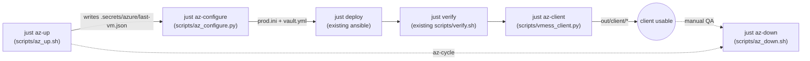

# Azure end-to-end validation

Thin Azure-CLI helper layer that plugs into the existing Ansible flow — no new Ansible role, no Terraform. Keeps the "Ansible-only, VM creation is click-ops" constraint from [CLAUDE.md](CLAUDE.md) intact; the helpers just script the click-ops part for a reproducible throwaway test.

## Flow



## File layout (new)

- `scripts/az_up.sh` — bash, wraps `az` CLI
- `scripts/az_down.sh` — bash, `az group delete`
- `scripts/az_configure.py` — uv-script, writes inventory + vault
- `scripts/vmess_client.py` — uv-script, emits client configs
- `.secrets/azure/last-vm.json` — gitignored, outputs of last `az-up`
- `.secrets/.vault-pass` — gitignored, auto-generated if missing
- `out/client/` — gitignored, generated client configs
- Justfile — 6 new targets: `az-up`, `az-configure`, `az-client`, `az-down`, `az-cycle`, updated `.gitignore`

## Design decisions

- **Region / SKU**: default `japaneast` / `Standard_B2ats_v2` (your pick). Override via env: `AZ_LOCATION`, `AZ_VM_SIZE`.
- **DNS name**: `az` auto-creates `<prefix>.japaneast.cloudapp.azure.com` via `--public-ip-address-dns-name $PREFIX`, matching what [vault.yml.example](ansible/group_vars/vpn/vault.yml.example) already assumes. Random 8-char prefix default; retries once on 409 collision.
- **SSH key**: reuse `~/.ssh/id_ed25519.pub` (fail fast if absent). Admin user: `azureuser`.
- **LE email**: default = `git config user.email`; overridable via `LE_EMAIL` env. Script errors out if git email is empty/placeholder and no env set.
- **UUID**: `uuidgen` per run, written fresh into the vault.
- **Vault password**: if `~/.vault-pass` and `$ANSIBLE_VAULT_PASSWORD_FILE` both absent, generate `.secrets/.vault-pass` (random 32 hex), export it for the session. Never overwrite an existing one.
- **NSG**: `az vm open-port` for 22, 80, 443 (priorities 300/310/320). UFW on the VM still handles in-VM firewalling via the existing [common role](ansible/roles/common/tasks/main.yml).
- **TLS**: Let's Encrypt production (not staging). Each test run gets a fresh DNS name, so no LE rate-limit collision. One cert per test VM, thrown away with the RG.

## Script responsibilities

### `scripts/az_up.sh`

```
AZ_RG           default: vpn-test-$(whoami)-$(date +%s)
AZ_LOCATION     default: japaneast
AZ_VM_NAME      default: vpn
AZ_VM_SIZE      default: Standard_B2ats_v2
AZ_IMAGE        default: Ubuntu2404
AZ_ADMIN_USER   default: azureuser
AZ_SSH_PUBKEY   default: ~/.ssh/id_ed25519.pub
AZ_DNS_PREFIX   default: vpn-$(openssl rand -hex 4)
```

Steps:
1. Preflight: `az account show` (assume already logged in), check SSH pubkey exists.
2. `az group create`, `az vm create` (with `--public-ip-address-dns-name`).
3. `az vm open-port` for 22, 80, 443.
4. Poll SSH readiness (retry `ssh -o BatchMode=yes -o ConnectTimeout=5 true`, up to 60s).
5. Write `.secrets/azure/last-vm.json`:


```json
   {"rg":"...","vm":"...","location":"japaneast","fqdn":"vpn-abc123.japaneast.cloudapp.azure.com","public_ip":"1.2.3.4","admin_user":"azureuser","created_at":"..."}


```

### `scripts/az_configure.py` (uv-script, stdlib-only)

Reads `.secrets/azure/last-vm.json`; writes [`ansible/inventory/prod.ini`](ansible/inventory/prod.ini.example) with one `[vpn]` entry and [`ansible/group_vars/vpn/vault.yml`](ansible/group_vars/vpn/vault.yml.example) with `vault_domain / vault_letsencrypt_email / vault_v2ray_uuid`. Then shells out to `ansible-vault encrypt`. Idempotent: refuses to clobber a pre-existing encrypted vault without `--force`.

### `scripts/vmess_client.py` (uv-script)

```python
# /// script
# requires-python = ">=3.11"
# dependencies = ["PyYAML>=6", "qrcode[pil]>=7.4"]
# ///
```

Reads domain + UUID by shelling to `ansible-vault view`, then emits into `out/client/`:
- `vmess.txt` — single line `vmess://<base64(json)>` (standard v2rayN/Shadowrocket encoding with `v=2, ps, add, port=443, id, aid=64, net=ws, type=none, host, path=/v2ray, tls=tls`)
- `config.json` — pretty-printed inner JSON (for v2rayN "import from clipboard" fallback)
- `clash.yaml` — single proxy entry matching the shape of [clients/docker/config.yaml](clients/docker/config.yaml) lines 46–58
- `human.md` — the table already documented in [README.md lines 49–58](README.md)
- `qr.png` — PNG of the `vmess://` link (for Shadowrocket "scan from album")
- Also prints ASCII QR + human-readable block to stdout

### `scripts/az_down.sh`

`az group delete --name "$AZ_RG" --yes --no-wait` + removes `.secrets/azure/last-vm.json` on success. `-y` skips the confirmation prompt.

## Justfile additions

```
az-up:         scripts/az_up.sh
az-configure:  scripts/az_configure.py
az-client:     scripts/vmess_client.py
az-down:       scripts/az_down.sh
az-cycle:      az-up + az-configure + deploy + verify + az-client + (pause) + az-down
```

`az-cycle` wires the full loop with one `read -p "press enter to tear down..."` before `az-down`, so you get the client configs + a working VM to test against before the RG dies.

## .gitignore additions

```
.secrets/
out/
```

(`.secrets/` holds `azure/last-vm.json` and the auto-generated `.vault-pass`; `out/client/` holds generated client artifacts.)

## Cost / safety notes

- B2ats_v2 in japaneast is ~$0.019/hr (~$0.05 for a 2–3 hour test). RG name embeds `$(whoami)-$(date +%s)` so repeated tests don't collide and stale RGs are obvious in `az group list -o table`.
- Vault stays ansible-vault-encrypted, so even the throwaway vault file is safe to leave on disk between runs.
- `.secrets/azure/last-vm.json` contains the FQDN + public IP (not secret, but useful to gitignore so test runs don't pollute `git status`).
