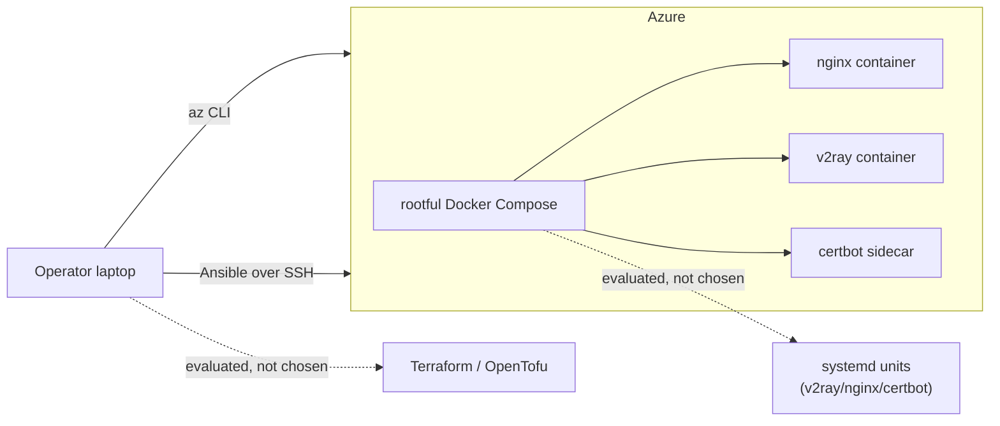

## Scope

Two new docs under [docs/](docs/). No code, compose, or role changes. Cross-link from [README.md](README.md) (the "Repo layout" table's `docs/` row).

Both docs take as given the constraints already in [CLAUDE.md](CLAUDE.md):

- Ansible only (not Terraform/OpenTofu) for config management.
- Rootful Docker.
- TLS always, VMess over WebSocket, single operator.

So the evaluations record *why*, not re-open the decisions.

## Files

### 1. `docs/DeploymentEvaluation.md` — the big-picture map

One page, two layers:

- **Provisioning layer (VM lifecycle).** Why `scripts/az_up.sh` + `az_configure.py` are imperative shell/Python instead of Terraform/OpenTofu/Bicep modules. Key points from the code:
  - `scripts/az_up.sh` is throwaway-VM oriented (per-RG ed25519 key under `.secrets/azure/<rg>/`, DevTest auto-shutdown, `last-vm.json` handoff to Ansible).
  - Operator moves between Azure/GCP/Hetzner (per `CLAUDE.md`), so provider-neutral IaC state would be pure overhead for a single VM.
  - Cost of adding Terraform: state file management, provider lock-in per cloud anyway (`azurerm` vs `google` vs `hcloud`), no benefit on VM count = 1.
- **Runtime layer (what runs on the box).** Pointer to `BareMetalEvaluation.md` for the Docker Compose vs bare-metal + systemd question.
- **Decision summary table (bullets, not a markdown table)** with the chosen option per layer and the one-line reason.
- **When to revisit**: multi-VPS, multi-tenant, cost optimization below B2ats_v2, protocol migration to Xray/VLESS (cross-ref `docs/XrayUI.md`).

### 2. `docs/BareMetalEvaluation.md` — Docker Compose vs bare-metal + systemd

Concrete, project-specific. Sections:

- **What "bare metal" would look like here.** Three systemd units replacing [server/compose.yml](server/compose.yml): `v2ray.service` (apt/upstream binary, reads `/etc/v2ray/config.json`), `nginx.service` (distro package, configs under `/etc/nginx/conf.d/`), `certbot.timer` (snap or pip, webroot at `/var/www/certbot`). Ansible `vpn` role would render `.conf` files under `/etc/` and `notify: restart` handlers instead of `notify: recreate stack`.
- **Side-by-side comparison** (bullets per axis, no markdown table):
  - Install/upgrade: `apt install` on a pinned Ubuntu 24.04 vs pulling `v2ray/official:latest` + `nginx:latest`. Docker wins on version independence from distro; bare metal wins on smaller attack surface and no daemon.
  - Config churn: today both nginx + V2Ray configs live in [server/templates/](server/templates/) rendered via `.j2` — that doesn't change. What changes is `docker compose up` → `systemctl reload` handlers and the cert-bootstrap dance in [ansible/roles/letsencrypt/tasks/main.yml](ansible/roles/letsencrypt/tasks/main.yml).
  - Let's Encrypt bootstrap: the two-phase ACME-only → full-nginx flow (documented in `CLAUDE.md` "Let's Encrypt bootstrap") gets simpler on bare metal — `certbot --nginx` handles the config rewrite natively, no `acme-only.conf.j2` split needed. One real win for bare metal.
  - Log/volume layout: bind-mounts (`./runtime/logs/...`) vs `/var/log/{nginx,v2ray}/` + logrotate. Tie.
  - Failure isolation + restart: `restart: unless-stopped` + container boundary vs `Restart=on-failure` + systemd cgroup. Tie.
  - Rootful-Docker-specific pain: the `cannot expose privileged port 80` class of errors goes away on bare metal. Minor win.
  - Reproducibility on a throwaway Azure VM (`just az-cycle`): `docker compose` = identical image digests; apt = whatever Ubuntu ships today. Docker wins.
  - Test harness: [test/Dockerfile](test/Dockerfile) already can't validate systemd or Docker-in-Docker (per `CLAUDE.md` "Local test harness scope"). Going bare-metal would need a VM-based harness (Vagrant / Multipass / Molecule+LXD), materially more complex.
- **Migration cost if we did switch**: rewrite `ansible/roles/vpn` + `ansible/roles/letsencrypt`, delete [server/compose.yml](server/compose.yml), delete the `community.docker` collection requirement, rewrite `just logs-v2ray` / `just logs-nginx` / `just ps`, rewrite the `verify.sh` smoke test's assumptions, rework the `test/` harness. Roughly a repeat of the original IaC refactor.
- **Decision**: stay on rootful Docker Compose. Record the one genuine bare-metal win (simpler LE bootstrap) as "known, accepted tradeoff".
- **Future escape hatch**: if the operator ever drops Docker, the bare-metal layout sketched above is the target; link to the archived shell-script flow in [docs/LEGACY.md](docs/LEGACY.md) as partial precedent (pre-Docker configs lived under `/etc/` similarly).

### 3. `README.md` — single-line cross-ref

Update the `docs/` row in the "Repo layout" table to mention the two new files, matching the existing style.

## Diagram (included in `DeploymentEvaluation.md`)

## Non-goals

- No edits to `ansible/`, `server/`, `scripts/`, `Justfile`, or compose.
- No re-litigation of "Ansible vs Terraform" or "rootful vs rootless Docker" — those are marked "decided — don't re-litigate" in `CLAUDE.md`; the docs reference that decision, they don't overturn it.
- No Chinese translation (decided in the clarifying Q).
