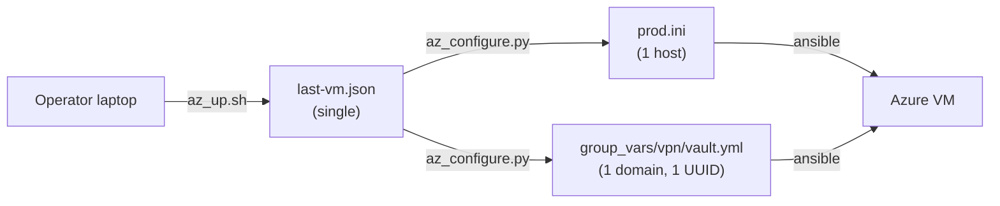
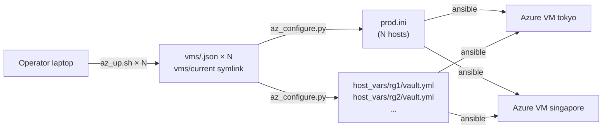
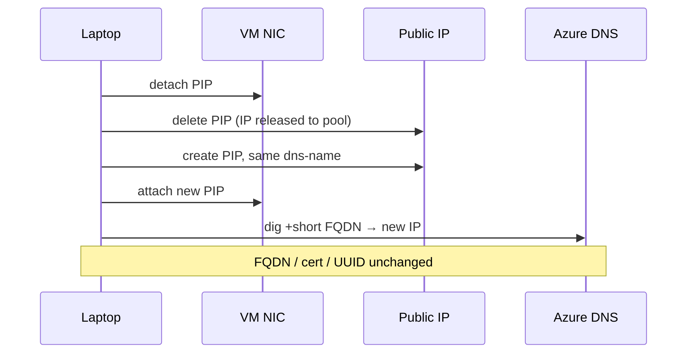

# IP rotation + multi-host deploy

Two **independent** PRs. Either can merge first. No shared files except a one-liner cross-ref in [README.md](README.md).

## Why two PRs, not one

- **IP rotation** = same VM, same FQDN, new public IP. No inventory / vault changes.
- **Multi-host** = multiple VMs, multiple FQDNs. Touches `last-vm.json` layout, `az_configure.py`, `host_vars/`, and every `az_*` helper.

They're orthogonal (per OpenCode feedback section IV). Mixing them in one PR would bloat the review and couple unrelated risk.

---

## PR 1 — `just az-rotate-ip <rg>` (small, standalone, ship first)

### What it does

Rotate the Standard SKU public IP attached to an Azure VM, keeping the `<dns-label>.<region>.cloudapp.azure.com` FQDN unchanged. FQDN stays → Let's Encrypt cert stays → `vault_domain` stays → client configs stay. Just a new IP from Azure's pool.

Relies on a property of Azure's Standard SKU PIP + DNS label: **the DNS label is a region-unique string stored on the PIP resource, not bound to the IP itself.** Delete and recreate the PIP with the same `--dns-name` → same FQDN, new IP.

### Files

- **New: [scripts/az_rotate_ip.sh](scripts/az_rotate_ip.sh)** — bash, `set -euo pipefail`, same log / die pattern as [scripts/az_up.sh](scripts/az_up.sh).
- **New: [docs/IP-ROTATION.md](docs/IP-ROTATION.md)** — when to use, what it does / doesn't change, footguns, future cross-cloud notes (1-2 paragraphs pointing at custom-domain + DNS API as "when we actually go multi-cloud").
- **Edit: [Justfile](Justfile)** — add `az-rotate-ip` target after `az-down`.
- **Edit: [README.md](README.md)** — one-line mention in the "One-shot Azure validation" section.

### `scripts/az_rotate_ip.sh` flow

```bash
# Inputs
#   AZ_RG (required — positional arg or env var)
#   Reads .secrets/azure/last-vm.json (pre-multi-host) OR
#         .secrets/azure/vms/<rg>.json (post-multi-host) for location/vm/dns_label

# Preflight
#   - az CLI logged in
#   - RG exists
#   - PIP on the VM is sku=Standard (refuse if Basic; print migration hint)
#   - Running from laptop, not the VPS (check hostname or bail on $SSH_CONNECTION)

# Rotation (idempotent-ish; each step checks current state)
#   1. Read PIP name, dns_label, location from the VM's NIC ip-config
#   2. az network nic ip-config update --remove PublicIPAddress     # detach
#   3. az network public-ip delete  -g $RG -n $PIP                  # release IP
#   4. az network public-ip create  -g $RG -n $PIP \
#        --sku Standard --allocation-method Static \
#        --dns-name $SAME_LABEL                                     # new IP, same FQDN
#   5. az network nic ip-config update --set PublicIPAddress=...    # reattach
#   6. Capture new IP; update .secrets/azure/{last-vm.json|vms/$RG.json} public_ip field
#   7. dig +short $FQDN  → verify DNS propagated (<30s usually)
#   8. Log: "FQDN / cert / UUID unchanged — no client reconfiguration needed"
```

### Footguns (print at start + top of docs)

- **Runs on laptop only.** The script cannot run on the VPS itself — step 2 would kill its own SSH session before step 5 can reattach.
- **~30-60s outage.** Between detach and reattach, the VM has no public IP. Existing TCP connections break.
- **DNS label is kept, not the IP.** If you need a stable IP (allow-lists elsewhere), this script is the wrong tool.
- **Standard SKU only.** Refuse on Basic SKU (already retired 2025-09-30 per [MS announcement](https://azure.microsoft.com/updates/upgrade-to-standard-sku-public-ip-addresses-in-azure-by-30-september-2025-basic-sku-will-be-retired/)); `az_up.sh` already uses Standard so this is only a sanity check.

### Out of scope for PR 1

- Custom-domain rotation (Cloudflare / Azure DNS / Route53). Documented as "future, when `CLAUDE.md` line 88 actually materializes." A one-paragraph outline in `docs/IP-ROTATION.md` is enough.
- Any change to `ansible/` — cert, vault, nginx conf all untouched by design.

---

## PR 2 — Multi-host (structural, ship after PR 1 merges)

### Shape change

- `.secrets/azure/last-vm.json` (single file) → `.secrets/azure/vms/<rg>.json` (one per VM) + `.secrets/azure/vms/current` symlink to the most recent.
- `ansible/group_vars/vpn/vault.yml` (single) → `ansible/host_vars/<host>/vault.yml` (per-host). Each VM has its own `vault_domain` and `vault_v2ray_uuid`.
- `ansible/group_vars/vpn/vars.yml` stays — it's just the plain-name alias layer; works for any host.
- Inventory: `[vpn]` section grows from one `azure …` line to one per RG, host name = RG name (unique per-cycle, maps cleanly to `host_vars/<rg>/`).

### Backward compat

- `scripts/az_up.sh` writes `vms/<rg>.json` (new primary) + maintains `last-vm.json` as a copy-of-current for one release cycle, tagged with a deprecation note.
- `scripts/vmess_client.py` and any other reader prefers `vms/current` → falls back to `last-vm.json`. Delete `last-vm.json` fallback in a follow-up PR after this is proven.

### Files

**Edits:**

- [scripts/az_up.sh](scripts/az_up.sh) — drop the "refuse if last-vm.json exists" guard (line 81-83); write `vms/<rg>.json`, update `vms/current` symlink; skip the `AZ_OVERWRITE` codepath.
- [scripts/az_configure.py](scripts/az_configure.py) — `load_vm()` → `load_vms()` (list); `write_inventory()` loops; `write_vault()` writes to `ansible/host_vars/<rg>/vault.yml` per VM.
- [scripts/az_down.sh](scripts/az_down.sh) — accept positional `<rg>` or read from `vms/current`; remove only that VM's `vms/<rg>.json` + `host_vars/<rg>/`; update `vms/current` to the next most recent (or unlink if empty).
- [scripts/vmess_client.py](scripts/vmess_client.py) — accept `--host <rg>` / `RG=<rg>`; default to `vms/current`; decrypts per-host vault at `host_vars/<rg>/vault.yml`.
- [scripts/verify.sh](scripts/verify.sh) — already takes `DOMAIN` env var, no code change but docs update: "loop with `for rg in vms/*.json; do DOMAIN=$(jq -r .fqdn $rg) just verify; done`".
- [Justfile](Justfile) — `az-client`, `az-down` accept `RG=<rg>` (default: `vms/current`); `az-cycle` documents it tears down only the last-created VM; `deploy` unchanged (Ansible handles the multi-host loop natively).
- [ansible/inventory/prod.ini.example](ansible/inventory/prod.ini.example) — example with two hosts to document the shape.
- [ansible/group_vars/vpn/vault.yml.example](ansible/group_vars/vpn/vault.yml.example) — add a header note "if you use the Azure throwaway flow, vault lives under host_vars/<rg>/vault.yml instead."

**New:**

- [docs/MULTI-HOST.md](docs/MULTI-HOST.md) — records the decision (option B from the clarifying Q, not A / not C), shape of `vms/<rg>.json`, `host_vars/<rg>/vault.yml` layout, how `just deploy` targets all hosts vs `RG=xxx just az-client` targets one. One mermaid showing laptop → `vms/` → inventory → N Azure VMs.

### Target selection convention

OpenCode raised "拒絕跑 + 列出選項 vs 全部跑." Proposal:

- `just deploy`: **run against all hosts.** Ansible does this natively via `[vpn]` group. This is the desired behavior — update all nodes at once.
- `just verify`, `just az-client`, `just az-down`: **require `RG=<rg>` when >1 VM exists, list options otherwise.** These are per-host operations; silently defaulting to one is the footgun. Default to `vms/current` **only when exactly one VM exists**.
- `just az-cycle`: stays single-VM (it's the original up-deploy-verify-client-down loop); document that multi-host is manual composition of `az-up` × N + `deploy` + `az-down RG=xxx` × N.

### Out of scope for PR 2

- Multi-region parallelization. Each `az-up` is still one-at-a-time.
- Protecting against accidentally deploying an in-flight uuid rotation to only half the fleet — single operator, low risk, not worth the tooling.
- Migrating existing users automatically. First run after upgrade: a one-liner detects legacy `last-vm.json` and prints the migration command (`mv last-vm.json vms/$(jq -r .rg last-vm.json).json && ln -sf …`).

---

## Diagrams

### Before (today)



### After PR 2



### IP rotation (PR 1, any VM)



## Non-goals (both PRs)

- No Terraform / OpenTofu. Decided in [CLAUDE.md](CLAUDE.md) and [docs/DeploymentEvaluation.md](docs/DeploymentEvaluation.md).
- No protocol migration to Xray / VLESS.
- No custom-domain + DNS API integration. Cross-cloud rotation is marked "future, when actually needed" per OpenCode section III.
- No multi-tenant / shared vault. Single operator assumption holds.
