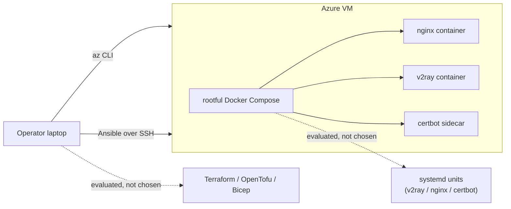

# Deployment evaluation

Why the current Ansible + rootful Docker Compose flow is the chosen deployment
shape, and what alternatives were evaluated but not adopted. Sibling doc
[BareMetalEvaluation.md](BareMetalEvaluation.md) drills into the runtime layer
in more detail.

This doc is a record, not an invitation to re-open the decisions. The hard
constraints in [CLAUDE.md](../CLAUDE.md) (Ansible-only, rootful Docker,
TLS-always, VMess / WebSocket, single operator) are taken as given.

## The two layers

Two independent axes, evaluated separately:

1. **Provisioning layer** — how the VM itself comes into existence (network,
   DNS, SSH key, firewall rules, auto-shutdown).
2. **Runtime layer** — how nginx, V2Ray and certbot run *on* that VM once it
   exists.

## Provisioning layer: imperative `az` CLI, not Terraform / OpenTofu / Bicep

The project provisions a VM via [`scripts/az_up.sh`](../scripts/az_up.sh) plus
[`scripts/az_configure.py`](../scripts/az_configure.py). Both are imperative
(shell + Python wrapping `az` CLI), not declarative IaC.

What these scripts actually do, from the code:

- Mint a per-resource-group ed25519 keypair under `.secrets/azure/<rg>/` on
  every run (or accept `AZ_SSH_PUBKEY=...` to reuse an existing one).
- Create RG + `Standard_B2ats_v2` VM + NSG (22 / 80 / 443) + a public-DNS
  label, then write the handoff file `.secrets/azure/last-vm.json`.
- Configure a DevTest-Labs daily auto-shutdown at `AZ_SHUTDOWN_TIME` as a
  safety net for forgotten VMs.
- Consume that handoff in `az_configure.py` to render
  `ansible/inventory/prod.ini` and an encrypted `group_vars/vpn/vault.yml`.
- Tear the whole thing down with [`scripts/az_down.sh`](../scripts/az_down.sh)
  (RG delete + key directory cleanup).

### Why not Terraform / OpenTofu / Bicep here

- **VM count is one, and it's disposable.** The whole `just az-cycle` loop is
  up → Ansible → verify → (optionally test) → down. Terraform state (local or
  remote) adds a layer of "does the state match reality?" bookkeeping that
  pays off with long-lived, multi-resource fleets — not with a single VM that
  may not exist tomorrow morning after `AZ_SHUTDOWN_TIME`.
- **Provider portability is not actually gained.** `CLAUDE.md` notes the
  operator moves between Azure, GCP, Hetzner. Terraform does not make that
  portable: you'd still write `azurerm_linux_virtual_machine`,
  `google_compute_instance`, and `hcloud_server` as three distinct resource
  graphs. At VM count = 1, the shell-per-provider approach
  (`scripts/az_up.sh`, a hypothetical `scripts/gcp_up.sh`, etc.) is the same
  work with less tooling.
- **Secrets handoff is already solved imperatively.** The
  `last-vm.json` → `ansible/inventory/prod.ini` → encrypted `vault.yml` chain
  is three files in a known location. A Terraform → Ansible handoff would
  need either `local_file` writes (re-implementing the same thing) or
  `terraform output -json` parsing (re-implementing the same thing with more
  YAML).
- **Cost estimation lives in the imperative script.** `scripts/az_up.sh`
  queries the Azure Retail Prices API and prints
  hourly/daily/monthly before prompting. That's an actively-useful feature
  for a cost-sensitive personal project, and it's not something Terraform
  gives you.

### Trade-offs accepted

- No drift detection. If you manually edit the NSG in the Azure portal,
  `az_up.sh` doesn't notice. Acceptable: the VM is disposable, so the fix
  is `just az-down && just az-up`.
- Each provider needs its own script. Acceptable: only Azure is wired up
  today; GCP / Hetzner are "write the script when you need it."

## Runtime layer: rootful Docker Compose, not bare-metal + systemd

See [BareMetalEvaluation.md](BareMetalEvaluation.md) for the full comparison.
One-line summary: Docker Compose wins on reproducibility (pinned image
digests survive distro upgrades), on the existing test harness staying
useful, and on not needing to rewrite the `vpn` + `letsencrypt` roles. The
one genuine bare-metal win (simpler Let's Encrypt bootstrap via
`certbot --nginx`) isn't enough to justify the migration.

## Decision summary

- **Provisioning:** imperative `az` CLI wrapped in shell + Python. Chosen
  because VM count is one and disposable; IaC state would be overhead.
- **Config management:** Ansible over SSH. Chosen — decided in `CLAUDE.md`
  and this doc doesn't re-litigate.
- **Runtime:** rootful Docker Compose. Chosen — see
  [BareMetalEvaluation.md](BareMetalEvaluation.md).
- **Secrets:** `ansible-vault` on `vault.yml`, with a plain-name alias layer
  in `vars.yml`. Chosen — decided in `CLAUDE.md`.

## When to revisit

Re-open either layer's decision if any of these become true:

- **Multi-VPS / multi-region.** More than one long-lived target pushes
  Terraform / OpenTofu from "overhead" to "net positive," and pushes runtime
  choice into "whatever boots fastest on the cheapest image."
- **Multi-tenant.** Sharing the VPN with other users moves the threat model;
  rootful Docker and the "single operator" assumption both need review.
- **Cost floor below `B2ats_v2`.** If a cheaper VM size can't fit the Docker
  daemon + three containers comfortably, bare-metal's lower memory footprint
  starts to matter.
- **Protocol migration to Xray / VLESS** (future consideration noted in
  [old/XrayUI.md](old/XrayUI.md)). A protocol change is a good forcing function to
  re-examine the whole runtime layer anyway.
- **Docker licensing / availability change.** Unlikely for OSS `docker-ce`,
  but the bare-metal path in `BareMetalEvaluation.md` is the pre-drawn
  escape hatch.

Absent any of the above, the current shape is intentional and should stay.
