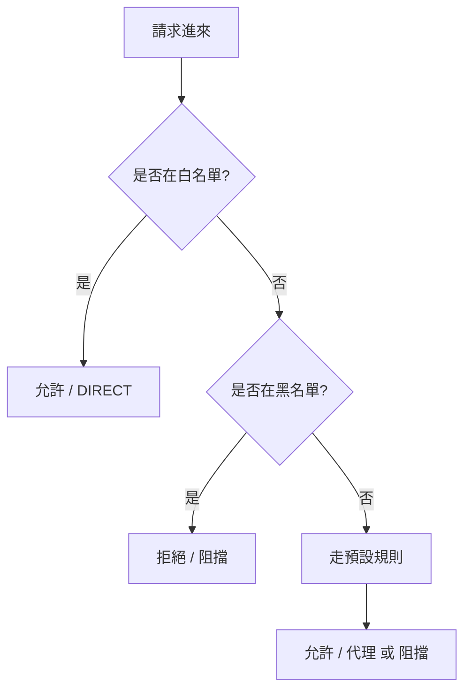
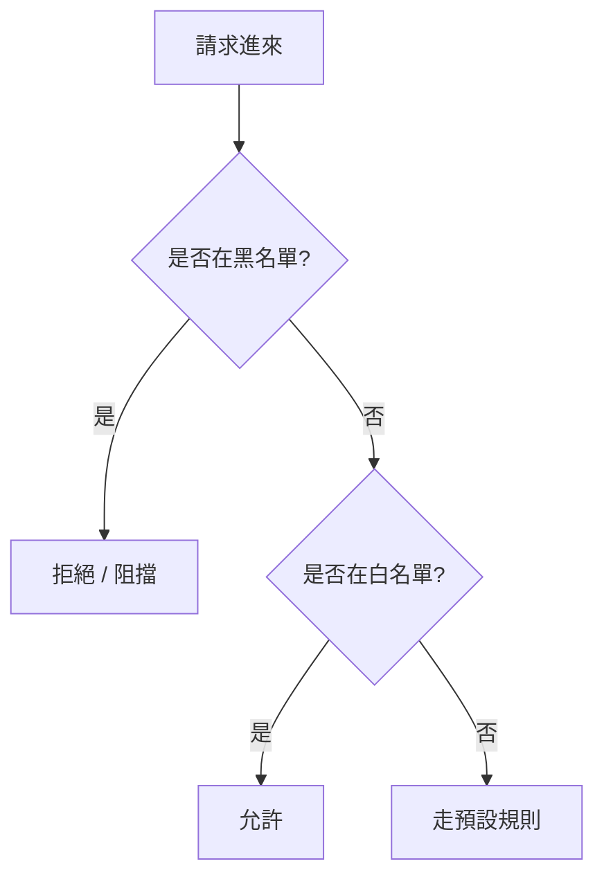
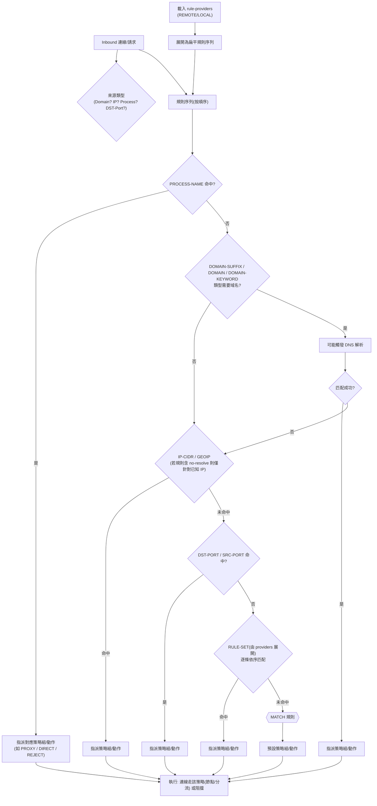
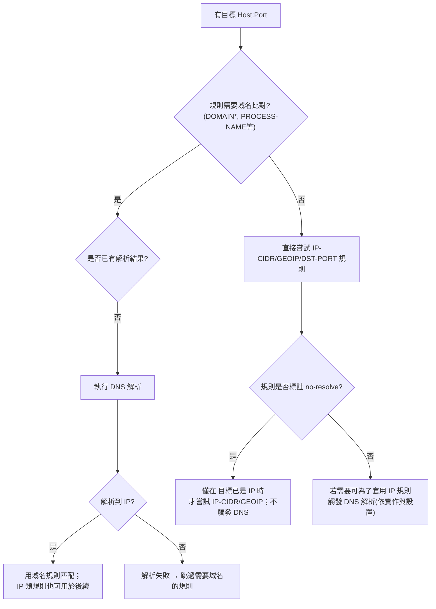

```mermaid
flowchart TD
    A[請求進來] --> B{是否在白名單?}
    B -- 是 --> C[允許 / DIRECT]
    B -- 否 --> D{是否在黑名單?}
    D -- 是 --> E[拒絕 / 阻擋]
    D -- 否 --> F[走預設規則]
    F --> G[允許 / 代理 或 阻擋]
```

```mermaid
flowchart TD
    A[請求進來] --> B{是否在黑名單?}
    B -- 是 --> E[拒絕 / 阻擋]
    B -- 否 --> C{是否在白名單?}
    C -- 是 --> F[允許]
    C -- 否 --> G[走預設規則]
```

```mermaid
flowchart TD
    IN[Inbound 連線/請求] --> SRC{"來源類型\n(Domain? IP? Process? DST-Port?)"}

    %% 導入 rule-providers
    RPROV["載入 rule-providers\n(REMOTE/LOCAL)"] --> RSEQ[展開為扁平規則序列]
    RSEQ --> PIPE

    IN --> PIPE["規則序列(按順序)"] --> R1{PROCESS-NAME 命中?}
    R1 -- 是 --> A1["指派對應策略組/動作\n(如 PROXY / DIRECT / REJECT)"]
    R1 -- 否 --> R2{DOMAIN-SUFFIX / DOMAIN / DOMAIN-KEYWORD\n類型需要域名?}
    R2 -- 否 --> R3
    R2 -- 是 --> DNSQ[可能觸發 DNS 解析]
    DNSQ --> R2b{匹配成功?}
    R2b -- 是 --> A2[指派策略組/動作]
    R2b -- 否 --> R3{"IP-CIDR / GEOIP\n(若規則含 no-resolve 則僅針對已知 IP)"}

    R3 -- 命中 --> A3[指派策略組/動作]
    R3 -- 未命中 --> R4{DST-PORT / SRC-PORT 命中?}
    R4 -- 是 --> A4[指派策略組/動作]
    R4 -- 否 --> R5{"RULE-SET(由 providers 展開)\n逐條依序匹配"}
    R5 -- 命中 --> A5[指派策略組/動作]
    R5 -- 未命中 --> RMATCH{{MATCH 規則}}
    RMATCH --> Adef[預設策略組/動作]

    %% 收斂
    A1 --> OUT["執行: 連線走該策略(節點/分流) 或阻擋"]
    A2 --> OUT
    A3 --> OUT
    A4 --> OUT
    A5 --> OUT
    Adef --> OUT
```

```mermaid
flowchart TD
    S[有目標 Host:Port] --> T{"規則需要域名比對? \n(DOMAIN*, PROCESS-NAME等)"}
    T -- 是 --> D1{是否已有解析結果?}
    D1 -- 否 --> RES[執行 DNS 解析]
    RES --> D2{解析到 IP?}
    D2 -- 是 --> M1[用域名規則匹配；\nIP 類規則也可用於後續]
    D2 -- 否 --> FALL[解析失敗 → 跳過需要域名的規則]
    T -- 否 --> M2[直接嘗試 IP-CIDR/GEOIP/DST-PORT 規則]

    %% no-resolve 分支
    M2 --> N{規則是否標註 no-resolve?}
    N -- 是 --> NR[僅在 目標已是 IP 時\n才嘗試 IP-CIDR/GEOIP；不觸發 DNS]
    N -- 否 --> YR["若需要可為了套用 IP 規則\n觸發 DNS 解析(依實作與設置)"]
```
