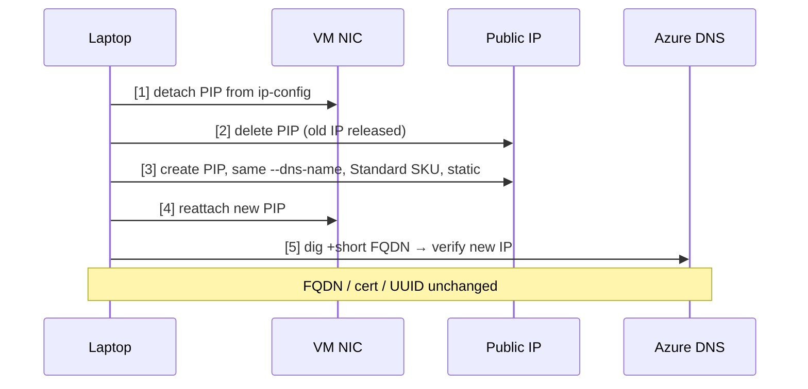

# IP rotation

Rotate the public IP of an Azure VM when the current one has been GFW-banned,
**without** changing the FQDN, TLS cert, `vault_domain`, or V2Ray UUID. Clients
keep working with zero reconfiguration.

## TL;DR

```bash
just az-rotate-ip                    # uses vms/current (or last-vm.json legacy)
just az-rotate-ip vpn-test-you-1234  # or explicit RG
AZ_YES=1 just az-rotate-ip           # skip confirm prompt
```

Takes ~30-60 seconds. Run from the **laptop**, never from the VPS (see footguns).

## What gets rotated

- Public IP address (new one assigned from the Azure pool).
- `.public_ip` field in `.secrets/azure/{vms/<rg>.json,last-vm.json}`.

## What stays unchanged

- `<dns-label>.<region>.cloudapp.azure.com` FQDN.
- Let's Encrypt certificate (cert is bound to FQDN, not IP).
- `vault_domain`, `vault_v2ray_uuid`, any client config you've already handed out.
- The VM itself, its disk, its `/opt/vpn/runtime/` state, and everything Ansible installed.

## How it works

Azure's Standard SKU public-IP resource holds the DNS label as a
region-unique property, not the IP itself. Delete and recreate the PIP with
the same `--dns-name` → new IP from the pool, same FQDN.



See [`scripts/az_rotate_ip.sh`](../scripts/az_rotate_ip.sh) for the full
shell flow (5 `az` calls + a state-file update + a `dig` verification loop).

## Footguns

- **Laptop-only.** The script refuses to run when `$SSH_CONNECTION` is set.
  Detaching the PIP severs connectivity to the VM before the reattach can
  happen; running this on the VPS itself would leave you locked out with a
  stranded NIC. `az_rotate_ip.sh` checks and bails if it sees it's over SSH.
- **~30-60s outage during the swap.** Existing TCP connections (including
  active client proxy sessions) will drop. Reconnects succeed as soon as
  step 4 finishes.
- **Not for stable-IP needs.** If some external system allow-lists your IP,
  this script is the wrong tool — it's the opposite of what it does. Use a
  reserved IP with `az network public-ip create --allocation-method Static`
  kept detached across VM teardowns instead.
- **Standard SKU only.** The script refuses on Basic SKU PIPs. Basic SKU
  was retired 2025-09-30 ([MS announcement](https://azure.microsoft.com/updates/upgrade-to-standard-sku-public-ip-addresses-in-azure-by-30-september-2025-basic-sku-will-be-retired/));
  [`scripts/az_up.sh`](../scripts/az_up.sh) already uses Standard, so this
  is only a sanity check for hand-rolled VMs.
- **Same label may occasionally collide mid-rotation.** Extremely unlikely
  (DNS labels are region-scoped and we're racing with ourselves, not other
  subscriptions), but if `az network public-ip create` fails at step 3 the
  NIC is left without a PIP. Rerun the script — it reads state fresh from
  Azure each time.

## When this is the wrong tool

- **You want a different region.** Rotating the IP within the same region
  doesn't help if the whole `*.japaneast.cloudapp.azure.com` block is
  reachable. Provision a second VM in another region instead (see
  [MULTI-HOST.md](MULTI-HOST.md) once that lands).
- **You want to migrate off Azure.** The DNS label is `*.cloudapp.azure.com`
  — tied to Azure. For cross-cloud rotation, see "future directions" below.

## Future directions (not implemented)

If the operator ever needs to rotate IPs across cloud providers (Azure →
GCP → Hetzner), the Azure-specific DNS label trick no longer applies. The
target shape would be:

1. Own a real domain (e.g. `vpn.example.com`).
2. Point an A record at the current VM's public IP using a DNS provider
   with an API (Cloudflare, Azure DNS, Route53).
3. Add an Ansible role (or standalone script) that updates the A record as
   part of rotation.
4. Optionally switch Let's Encrypt from HTTP-01 to DNS-01 so cert issuance
   doesn't depend on port 80.

This is deferred until cross-cloud operation is actually in progress (see
[CLAUDE.md](../CLAUDE.md) "operator moves between Azure, GCP, Hetzner" —
aspirational, not current). Introducing a DNS-provider token + API role
now would be premature abstraction.
