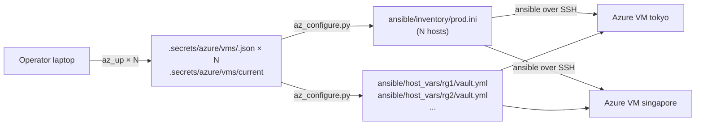

# Multi-host deploy (Azure throwaway flow)

Run two or more Azure VMs in different regions as separate jump nodes (e.g.
Japan East as the primary, Southeast Asia as a backup). Each VM has its own
FQDN, its own Let's Encrypt certificate, and its own V2Ray UUID. `just deploy`
targets all of them at once; per-VM operations (`just verify`,
`just az-client`, `just az-down`, `just az-rotate-ip`) take an explicit
`<rg>` argument.

## The shape



## State layout

- `.secrets/azure/vms/<rg>.json` — one file per VM. Written by
  [`scripts/az_up.sh`](../scripts/az_up.sh); fields: `rg`, `vm`, `location`,
  `fqdn`, `public_ip`, `admin_user`, `ssh_key`, `ssh_key_dir`,
  `shutdown_time`, `created_at`, `rotated_at`.
- `.secrets/azure/vms/current` — symlink to the most recently created
  `<rg>.json`. Drives the default target for `just az-client`, `just verify`
  and `just az-rotate-ip` **when exactly one VM is tracked**.
- `.secrets/azure/last-vm.json` — legacy mirror kept around for one release
  cycle so `vmess_client.py` and the old one-liners in this README still
  work. Safe to delete once all consumers move to `vms/`.
- `ansible/host_vars/<rg>/vault.yml` — encrypted per-host secrets
  (`vault_domain`, `vault_letsencrypt_email`, `vault_v2ray_uuid`). Written by
  [`scripts/az_configure.py`](../scripts/az_configure.py). Host name in the
  inventory == `<rg>` so host_vars lookup Just Works.
- `ansible/group_vars/vpn/vars.yml` — plain-name alias layer. Unchanged from
  the single-host flow; templates still reference `{{ domain }}` /
  `{{ v2ray_uuid }}` without caring which vault they came from.

## Typical flow

```bash
# Bring up two VMs in different regions.
AZ_LOCATION=japaneast     just az-up
AZ_LOCATION=southeastasia just az-up

# Regenerate inventory + per-host vaults. Each VM gets a fresh UUID at this
# stage (the vault is per-host). Re-run as many times as you like — existing
# encrypted vaults are preserved unless you pass --force.
just az-configure

# Deploy to all tracked VMs in one shot. Ansible fans out across the [vpn]
# group; the letsencrypt role runs per-host.
just deploy

# Per-host operations — require an explicit <rg> when >1 VM is tracked.
just az-client --rg vpn-test-you-1700000000           # or RG=... just az-client
RG=vpn-test-you-1700000000  just verify
just az-rotate-ip vpn-test-you-1700000000             # GFW-ban recovery; keeps FQDN
just az-down vpn-test-you-1700000100                  # retire one VM
```

## Target-selection convention

Symmetric across `just verify`, `just az-client`, `just az-down`, and
`just az-rotate-ip`:

- **Zero tracked VMs** → error, point at `just az-up`.
- **Exactly one tracked VM** → default to it (no argument needed).
- **Multiple tracked VMs** → require `<rg>` positional or `RG=<rg>` env var;
  if neither is passed, list the tracked RGs and exit non-zero.
  Silently defaulting to "whichever was last created" is a footgun when
  the wrong node gets torn down, so the scripts force the operator to be
  explicit.

`just deploy` is the exception — it runs against every host in `[vpn]`
(Ansible's default group semantics). This is the intended behavior: you
want config / UUID rotations to propagate atomically to every node.

`just az-cycle` stays strictly single-VM. It creates one VM, deploys, verifies,
and tears it down. Multi-region flows compose `az-up` + `deploy` + `az-down`
manually — see the block above.

## Why this shape (not A, not C)

Evaluated three options for multi-host support:

- **A. Document-only.** Keep the single-VM helpers untouched, write a doc
  explaining "run `just az-up` N times with different AZ_RG, hand-merge
  `prod.ini`, move vault secrets around." Rejected: `last-vm.json` was a
  single-file state — running `az-up` twice either refused (with the
  `AZ_OVERWRITE` guard) or orphaned the prior VM. Hand-merging inventory
  and vault entries every cycle was an invitation for mistakes.
- **B. Lightweight structural change.** Replace `last-vm.json` with
  `vms/<rg>.json` plus a `vms/current` symlink; `az_configure.py` scans
  the directory and emits multi-host inventory + per-host vaults; per-VM
  commands take an RG argument. **Chosen.** Solves the real problems
  (multi-RG coexistence, per-host secrets) without introducing fleet
  management.
- **C. First-class fleet.** Add `just az-up-region <region>` /
  `just az-list` / parallel deploys / cross-host health dashboards.
  Rejected as overkill — this is a single-operator personal VPN, not a
  fleet. The complexity of "which subset of VMs does this command target"
  plus "which ones deployed successfully" plus rollback semantics is real
  work that pays off only if the operator actually manages many hosts.

Decision summary: option (B) was the smallest change that unblocked
multi-region use (different IPs, geographic failover) without committing
to fleet-management overhead.

## Interaction with `just az-rotate-ip`

See [IP-ROTATION.md](IP-ROTATION.md) for the details. Short version:
rotation is scoped to one VM at a time; the script reads
`vms/<rg>.json` (or `vms/current`), swaps the public IP via the Azure
DNS label trick, and writes the new IP back into the same state file.
FQDN / cert / UUID / client config all stay intact — no redeploy needed.

## Non-goals

- **Parallel `az-up`.** Each `az-up` is a separate invocation; Azure
  provisioning on a single operator laptop isn't the bottleneck.
- **Cross-host UUID consistency.** Each VM has its own UUID on purpose —
  revoking one host doesn't force every client to roll.
- **DNS-based load balancing / failover.** Clients pick a node (or you
  hand out region-specific client configs). If automated failover becomes
  useful, that's when [IP-ROTATION.md](IP-ROTATION.md)'s "future
  directions" (custom domain + DNS API) become relevant.
- **Non-Azure providers.** The throwaway helpers are Azure-specific. A
  GCP / Hetzner equivalent would be parallel scripts (`scripts/gcp_up.sh`
  etc.) writing to the same `vms/<rg>.json` layout, but none exist today.
