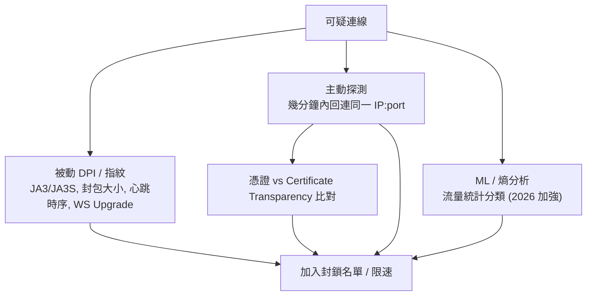

# 協議評估：VMess 還是首選？各方案與 GFW 偵測風險

系統性比較主流翻牆協議，回答「目前仍是 V2Ray (VMess) 首選嗎？有沒有更優方案？
以及被 GFW 探測的風險」。

**2026-07 更新**：本文原本只是研究記錄——當時 `CLAUDE.md` 把「遷移到 Xray / VLESS」
列為明確不在範圍內。那條約束已經解除：本專案的 default 現在是
**VLESS + XTLS-Vision + REALITY**（`vpn_protocol: reality`），舊的 VMess + WS + TLS
保留成可選模式（`vpn_protocol: vmess_ws`）。操作步驟見
[REALITY-MIGRATION.md](REALITY-MIGRATION.md)；下面補上了促成這個決定的**實機稽核**。
Client 端核心/生態見 [docs/clash/](clash/)。

## TL;DR

- **VMess 不是「死」，但 2026 年已不是抗審查的首選。** 它仍能用——尤其在 **GFW 以外**
  的環境（俄、伊朗、企業內網）；但它的靜態指紋（時間戳認證窗口、TLS/JA3、WS Upgrade）
  在強主動探測環境（中國大陸）越來越容易被 ML/DPI 標記。
- **2026 抗審查首選是 `VLESS + XTLS-Vision + REALITY`**（Xray-core / sing-box）。
  它做的是對一個真實大站（microsoft.com 等）的**真 TLS 1.3 握手**，憑證是該站的真憑證、
  在 CT log 裡查得到，**主動探測時把未授權連線透明代理回真站** → 沒有「假的」可被偵測。
- **Hysteria2 / TUIC** 是 QUIC/UDP 路線的備援：丟包網路上更快，但 GFW 自 2024 起加強
  QUIC 指紋識別，被動封 UDP 時就失效。
- **但真正推動本次遷移的不是上面這些通論**，而是下一節的實機稽核：我們跑的不只是
  「稍嫌老舊的 VMess」，而是**六年沒更新的 core** 加上 **VMess 最脆弱的那個變體**。

## 本專案實機稽核（2026-07）

以上是通論。回頭稽核這個 repo 實際部署出去的東西，發現三件比「VMess 比較舊」嚴重得多的事。
這三件才是遷移的真正理由。

### 1. Core 是六年沒更新的 binary

```yaml
# server/compose.yml + ansible/roles/vpn/templates/compose.yml.j2（修正前）
image: v2ray/official:latest
```

Docker Hub 上的 `v2ray/official` **最後一次推送在六年前**（v4.x 時代）。`:latest` 這個 tag
給人「會自己跟上」的錯覺，實際上它凍結在 2019/2020。也就是說線上那顆 core 六年沒有收過任何
安全修補，期間 V2Ray 生態早已分家（v2fly 接手）並且發過多次協議層修正。

> 上游現在的建議：v2fly 用 `ghcr.io/v2fly/v2ray:latest-extra`；Xray 用
> `ghcr.io/xtls/xray-core`。**兩者都不是 `v2ray/official`。**

### 2. `alterId: 64` — VMess 最脆弱的變體

```json
// server/templates/v2ray/config.json.tmpl:17（修正前）
"alterId": 64
```

`alterId > 0` 走的是**舊式 MD5 認證的非 AEAD VMess**。這正是 VMess 歷史上被主動探測與重放
攻擊打穿的那條路徑，上游早已淘汰、建議一律 `alterId: 0`（AEAD）。

值得記一筆的是**這個錯誤在 repo 裡是一致的**：`config.json.tmpl`、`config.json.j2`、
client 產生器（當時叫 `scripts/vmess_client.py`，現為 `client_config.py`）的
`DEFAULT_ALTER_ID = 64`、`README.md` 的 client 說明、
`clients/docker/config.yaml` 的兩個 proxy——全部都是 64。而
[`docs/clash/Core.md`](clash/Core.md) 早在做 client 研究時就寫下「這是舊式 VMess
（MD5 認證，已淘汰）」，卻沒有人回頭改 server 端。**文件先知道了，部署沒跟上。**

> 換到 Xray-core 之後這件事被強制解決：Xray **完全移除**了 `alterId > 0` 的支援，
> 舊 client 不改成 AEAD 就完全連不上。

### 3. 靜態特徵疊加

三個都不致命，疊在一起就構成一組很好認的簽名：

| 特徵 | 值 | 問題 |
|---|---|---|
| SNI | `*.japaneast.cloudapp.azure.com` | 雲端動態 FQDN。真實網站幾乎不會長這樣，而 VPN 節點很常 |
| WS path | 固定 `/v2ray` | 字面上就寫著協議名 |
| 憑證 | 自己的 Let's Encrypt | CT log 裡是一個沒有流量歷史的孤兒網域 |

單看每一項都能辯解，但「Azure 動態網域 + 冷門 LE 憑證 + 一個叫 `/v2ray` 的 WebSocket
端點」這個組合，對被動 DPI 來說是免費的分類特徵。

REALITY 一次解決前兩項：SNI 借用真實大站、傳輸層不再是 WebSocket。第三項則是消失了——
我們不再出示自己的憑證。

## GFW 怎麼偵測（威脅模型）



- **被動指紋**：TLS 握手（版本/cipher/擴充順序 → JA3）、WS `Upgrade` 標頭、固定 path、
  封包大小與心跳時序。VMess 的時間戳認證窗口本身可指紋化。
- **主動探測**：見到可疑連線就主動回連、發非協議封包看反應。**沒有偽裝站**或回應行為
  與真 nginx 有細微差異的部署會被抓（Trojan 多半敗在這）。
- **憑證比對**：自簽或 Let's Encrypt 憑證 vs 宣稱 SNI 的 CT 記錄不符 → 暴露。
- **2026 升級（4 月那波）**：加入熵分析、更激進標記，甚至物理拔線。Reality 多數續命，
  部分自建 Shadowsocks 失效後遷往 Reality。趨勢：每次升級淘汰一層舊協議。

## 協議橫向比較

| 協議 / 組合 | 核心 | 傳輸 | 主動探測抗性 | 大陸 GFW 現況 (2026) | 效能 | 部署複雜度 |
|---|---|---|---|---|---|---|
| **VLESS + Vision + REALITY**（本專案現況） | Xray/sing-box | TCP | **高（最佳）** | **最可靠** | 高 | 中高 |
| VMess + WS + TLS（本專案 legacy 模式） | V2Ray/Xray | TCP/WS | 中（需真偽裝站） | 堪用但漸被標記 | 中 | 中 |
| VLESS + WS + TLS | Xray | TCP/WS | 中 | 同 VMess，略輕量 | 中 | 中 |
| Trojan (+TLS) | 多 | TCP | 中低 | 自簽/LE 憑證易被 CT 比對抓 | 中 | 低 |
| Shadowsocks-2022 | 多 | TCP | 低（裸協議）| 主動探測可識別；常被封 | 高 | 低 |
| Hysteria2 | hysteria | QUIC/UDP | 中 | 時靈時不靈（QUIC 指紋，~40% 偵測）| **很高（丟包網）** | 中 |
| TUIC v5 | tuic/sing-box | QUIC/UDP | 中 | 數據可接受，封 UDP 時失效 | 高 | 中 |
| NaiveProxy | naive | HTTP/2+TLS | **高** | 與 Reality 並列可靠 | 高 | 中高 |
| WireGuard / OpenVPN | — | UDP/TCP | 低 | 易被指紋/限速；崩潮期常掛 | 高 | 低 |

> 「主動探測抗性」「大陸現況」會隨 GFW 升級變動；以上為 2026 年中的社群共識快照。

## 逐項要點

### VLESS + XTLS-Vision + REALITY（本專案現況）
- **為何最強**：握手是對真實大站的真 TLS 1.3，憑證是真站憑證（CT 查得到）；
  主動探測被**透明代理回真站**，無「假」可抓。`xtls-rprx-vision` flow 消除 TLS-in-TLS 訊號。
- **代價**：TCP 路線，丟包行動網路上不如 QUIC；設定較複雜（需 x25519 金鑰對、short ID、
  借用 SNI）；client 需較新版本（v2rayNG / Shadowrocket / mihomo 皆支援）。
- 注意：**裸 Reality（無 Vision）** 在俄 TSPU 已開始失效，務必搭 Vision。
- 本專案怎麼落地、`dest` 怎麼選、有哪些坑：[REALITY-MIGRATION.md](REALITY-MIGRATION.md)。

### VMess + WebSocket + TLS（本專案 legacy 模式）
- **優點**：生態最成熟、所有歷史 client 都支援、WS 可過 CDN（再套一層前置）。
- **弱點**：VMess 認證時間戳可指紋；TLS/JA3 與 WS Upgrade 可被識別；**沒有真實偽裝站**
  時，主動探測會看到「不像正常網站」的回應。本專案是 nginx 反代 + 真實 LE 憑證 + 落地頁，
  比裸 VMess 好，但憑證仍是自己的、SNI 與 CT 不必然一致（見上面稽核第 3 點）。
- **仍要用的話**：`alterId: 0`（AEAD，Xray 下是唯一選項）、隨機 WS path、避免預設 `/ws`、
  用 utls 模擬瀏覽器指紋、套 CDN 前置、落地頁做得像真站。

### Trojan
- 真 TLS，過熵分析；但**憑證是自己的**，CT 比對 + 主動探測在高審查區命中率高
  （2025 年中 TSPU 對 Trojan 偵測率約 90%）。適合中低審查環境或搭高流量前置域名。

### Shadowsocks / Shadowsocks-2022
- 簡單、快、部署門檻低。SS2022 加密更現代，但本質是**裸協議**、無 TLS 偽裝，
  主動探測可識別，崩潮期常被封。Outline（SS 基礎）勝在「5 分鐘搞定」。

### Hysteria2 / TUIC v5（QUIC/UDP）
- **強項**：QUIC over UDP、低開銷、丟包/高延遲行動網路上吞吐遠勝 TCP 系。
  Hysteria2 的 Salamander 混淆讓 UDP 看似雜訊。
- **弱項**：GFW 自 2024 加強 QUIC 指紋；運營商**降權/封 UDP** 時直接失效。
  適合做 Reality 的**備援雙協議**，而非唯一依賴。

### NaiveProxy
- 基於 Chromium 網路棧的 HTTP/2+TLS，指紋天然像 Chrome；社群評價與 Reality 並列可靠。
  技術優秀但生態/client 較窄，適合技術型自建者當第二條線。

### gRPC / XHTTP / mKCP（傳輸層變體）
- **gRPC**（HTTP/2）：多路復用、指紋更難辨，可替代 WS 當傳輸。
- **XHTTP**：Xray 較新的傳輸，配 Reality 使用。
- **mKCP**：UDP 路線，抗丟包，但易被封 UDP，作特定場景補充。

## 偵測風險排序（大陸 GFW，由低到高）

```text
低風險 ── VLESS+Vision+REALITY ≈ NaiveProxy        ← 本專案現況
        │  Hysteria2 / TUIC（看 UDP 是否被封）
        │  VMess/VLESS + WS + TLS（需真偽裝站 + CDN）  ← 本專案 legacy 模式
        │  Trojan（憑證易被 CT 比對）
高風險 ── 裸 Shadowsocks / WireGuard / OpenVPN
```

## 選型建議

| 情境 | 建議 |
|---|---|
| 大陸直連、要最大存活率 | **VLESS + Vision + REALITY**（`vpn_protocol: reality`，本專案 default），備援 Hysteria2 |
| 大陸 + 行動網路為主、UDP 通 | Hysteria2 / TUIC 為主，Reality 備援 |
| GFW 以外（俄/伊朗/企業內網） | 兩者皆可；VMess/VLESS + WS + TLS 仍很堪用 |
| 手上還有一堆舊 client 設定 | `vpn_protocol: both` 過渡，逐台換完再切回 `reality` |
| 要最省事 | Outline / Shadowsocks（接受較高被封風險） |

## 決策記錄（2026-07）

**default 改為 `VLESS + XTLS-Vision + REALITY`。**

理由，按份量排序：

1. 上面的實機稽核。就算完全不談抗審查，「六年沒更新的 core」本身就該換掉，而換 core 這件事
   一旦要做，順手換協議的邊際成本很低——反正 client 設定都得重發一輪。
2. Xray-core 拿掉了 `alterId > 0`，等於強制修好稽核第 2 點。
3. REALITY 消滅了稽核第 3 點的整組靜態特徵：不再有我們的憑證、不再有 WebSocket、
   SNI 借自真實大站。

**代價**（誠實列出）：

- nginx 不再擁有 443，Let's Encrypt / certbot 在 default 模式下退場，`verify.sh` 的
  「憑證有效」檢查換了語意（見 [REALITY-MIGRATION.md](REALITY-MIGRATION.md)）。
- 多了一份必須管理的祕密（x25519 私鑰），vault 結構跟著變。
- 我們的可用性現在**依賴 `reality_dest` 那個站**。它掛了或封了我們的 IP，握手就壞。
- 舊 client 全部要重發設定。這也是保留 `both` 模式的原因。

**什麼時候該回頭用 `vmess_ws`**：需要 CDN 前置（REALITY 過不了 CDN）、或 client 端某個
裝置的 app 太舊不支援 Vision/REALITY。切換方式是改一個變數 + 重跑 deploy。

### 何時該重新檢視（下一次的觸發點）

- **裸 Reality 已在俄 TSPU 失效**——我們搭了 Vision，但這說明 REALITY 本身也在被追。
  如果哪天 Vision 也被標記，下一站是 QUIC 路線（Hysteria2 / TUIC）或 NaiveProxy。
- **`reality_dest` 站點失效或被牆**（見遷移文件的備選清單）。
- **主要使用情境從行動端變成丟包嚴重的網路**——TCP 系的 REALITY 在這種網路上輸給 QUIC 系。

## 參考

- [XTLS/Xray-examples — VLESS-TCP-XTLS-Vision-REALITY](https://github.com/XTLS/Xray-examples/blob/main/VLESS-TCP-XTLS-Vision-REALITY/REALITY.ENG.md)
- [Project X 官方文件：REALITY](https://xtls.github.io/en/config/transports/reality.html) ／
  [VLESS inbound](https://xtls.github.io/en/config/inbounds/vless.html) ／
  [安裝與 Docker image](https://xtls.github.io/en/document/install)
- [v2fly 安裝指南（為何不要用 `v2ray/official`）](https://www.v2fly.org/en_US/guide/install.html)
- [Censorship-circumvention protocols compared (Fexyn, 2026)](https://fexyn.com/blog/censorship-circumvention-protocols-compared)
- [Bypass the Great Firewall of China in 2026 (Fexyn)](https://fexyn.com/blog/bypass-great-firewall-china-2026)
- [VPN for China 2026: VLESS Reality (NexTunnel)](https://nextunnel.com/en/blog/vpn-china-gfw-2026)
- [V2Ray VMess & VLESS 2026 setup (VPNSmith)](https://www.vpnsmith.com/en/blog/v2ray-vmess-vless-setup-2026)
- [VMess 指紋與對策 / V2Ray 協議棧深入（ZhuqueVPN）](https://www.zhuquejiasu.com/en/blog/deep-dive-into-v2ray-protocol-stack-encryption-and-fingerprint-countermeasures-from-vmess-to-x-2)
