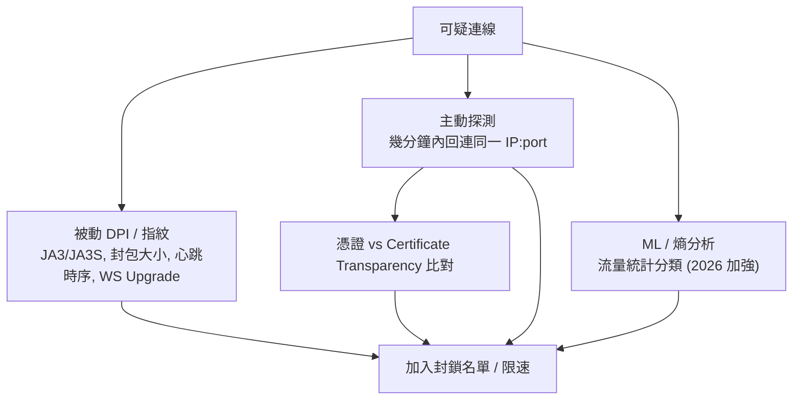

# 協議評估：VMess 還是首選？各方案與 GFW 偵測風險

系統性比較主流翻牆協議，回答「目前仍是 V2Ray (VMess) 首選嗎？有沒有更優方案？
以及被 GFW 探測的風險」。

這份是**研究記錄**，不是改動提案。本專案的硬約束在 [CLAUDE.md](../CLAUDE.md)
已定：**協議鎖定 V2Ray / VMess + WebSocket + TLS，遷移到 Xray / VLESS 明確不在範圍內**。
本文照樣把替代方案攤開比較，作為「何時該重新檢視」的依據（見文末）。
Client 端核心/生態見 [docs/clash/](clash/)。

## TL;DR

- **VMess 不是「死」，但 2026 年已不是抗審查的首選。** 它仍能用——尤其在 **GFW 以外**
  的環境（俄、伊朗、企業內網）；但它的靜態指紋（時間戳認證窗口、TLS/JA3、WS Upgrade）
  在強主動探測環境（中國大陸）越來越容易被 ML/DPI 標記。
- **2026 抗審查首選是 `VLESS + XTLS-Vision + REALITY`**（Xray-core / sing-box）。
  它做的是對一個真實大站（microsoft.com 等）的**真 TLS 1.3 握手**，憑證是該站的真憑證、
  在 CT log 裡查得到，**主動探測時把未授權連線透明代理回真站** → 沒有「假的」可被偵測。
- **Hysteria2 / TUIC** 是 QUIC/UDP 路線的備援：丟包網路上更快，但 GFW 自 2024 起加強
  QUIC 指紋識別，被動封 UDP 時就失效。
- 對**本專案**：VMess+WS+TLS 在「GFW 以外」或「搭配真實偽裝站 + CDN」仍堪用；
  若主要使用情境是大陸直連且頻繁被封，**Reality 是該重新檢視的觸發點**。

## GFW 怎麼偵測（威脅模型）



- **被動指紋**：TLS 握手（版本/cipher/擴充順序 → JA3）、WS `Upgrade` 標頭、固定 path、
  封包大小與心跳時序。VMess 的時間戳認證窗口本身可指紋化。
- **主動探測**：見到可疑連線就主動回連、發非協議封包看反應。**沒有偽裝站**或回應行為
  與真 nginx 有細微差異的部署會被抓（Trojan 多半敗在這）。
- **憑證比對**：自簽或 Let's Encrypt 憑證 vs 宣稱 SNI 的 CT 記錄不符 → 暴露。
- **2026 升級（4 月那波）**：加入熵分析、更激進標記，甚至物理拔線。Reality 多數續命，
  部分自建 Shadowsocks 失效後遷往 Reality。趨勢：每次升級淘汰一層舊協議。

## 協議橫向比較

| 協議 / 組合 | 核心 | 傳輸 | 主動探測抗性 | 大陸 GFW 現況 (2026) | 效能 | 部署複雜度 |
|---|---|---|---|---|---|---|
| **VMess + WS + TLS**（本專案） | V2Ray/Xray | TCP/WS | 中（需真偽裝站） | 堪用但漸被標記 | 中 | 中 |
| VLESS + WS + TLS | Xray | TCP/WS | 中 | 同 VMess，略輕量 | 中 | 中 |
| **VLESS + Vision + REALITY** | Xray/sing-box | TCP | **高（最佳）** | **最可靠** | 高 | 中高 |
| Trojan (+TLS) | 多 | TCP | 中低 | 自簽/LE 憑證易被 CT 比對抓 | 中 | 低 |
| Shadowsocks-2022 | 多 | TCP | 低（裸協議）| 主動探測可識別；常被封 | 高 | 低 |
| Hysteria2 | hysteria | QUIC/UDP | 中 | 時靈時不靈（QUIC 指紋，~40% 偵測）| **很高（丟包網）** | 中 |
| TUIC v5 | tuic/sing-box | QUIC/UDP | 中 | 數據可接受，封 UDP 時失效 | 高 | 中 |
| NaiveProxy | naive | HTTP/2+TLS | **高** | 與 Reality 並列可靠 | 高 | 中高 |
| WireGuard / OpenVPN | — | UDP/TCP | 低 | 易被指紋/限速；崩潮期常掛 | 高 | 低 |

> 「主動探測抗性」「大陸現況」會隨 GFW 升級變動；以上為 2026 年中的社群共識快照。

## 逐項要點

### VMess + WebSocket + TLS（本專案現況）
- **優點**：生態最成熟、所有歷史 client 都支援、WS 可過 CDN（再套一層前置）。
- **弱點**：VMess 認證時間戳可指紋；TLS/JA3 與 WS Upgrade 可被識別；**沒有真實偽裝站**
  時，主動探測會看到「不像正常網站」的回應。本專案是 nginx 反代 + 真實 LE 憑證 + 落地頁，
  比裸 VMess 好，但憑證仍是自己的、SNI 與 CT 不必然一致。
- **加固**：path 隨機化、避免預設 `/ws`、用 utls 模擬瀏覽器指紋、`alterId: 0`（AEAD）、
  套 CDN 前置、落地頁做得像真站。

### VLESS + XTLS-Vision + REALITY（2026 首選）
- **為何最強**：握手是對真實大站的真 TLS 1.3，憑證是真站憑證（CT 查得到）；
  主動探測被**透明代理回真站**，無「假」可抓。`xtls-rprx-vision` flow 消除 TLS-in-TLS 訊號。
- **代價**：TCP 路線，丟包行動網路上不如 QUIC；設定較複雜（需 x25519 金鑰對、short ID、
  借用 SNI）；client 需較新版本（v2rayNG / Shadowrocket / mihomo 皆支援）。
- 注意：**裸 Reality（無 Vision）** 在俄 TSPU 已開始失效，務必搭 Vision。

### Trojan
- 真 TLS，過熵分析；但**憑證是自己的**，CT 比對 + 主動探測在高審查區命中率高
  （2025 年中 TSPU 對 Trojan 偵測率約 90%）。適合中低審查環境或搭高流量前置域名。

### Shadowsocks / Shadowsocks-2022
- 簡單、快、部署門檻低。SS2022 加密更現代，但本質是**裸協議**、無 TLS 偽裝，
  主動探測可識別，崩潮期常被封。Outline（SS 基礎）勝在「5 分鐘搞定」。

### Hysteria2 / TUIC v5（QUIC/UDP）
- **強項**：QUIC over UDP、低開銷、丟包/高延遲行動網路上吞吐遠勝 TCP 系。
  Hysteria2 的 Salamander 混淆讓 UDP 看似雜訊。
- **弱項**：GFW 自 2024 加強 QUIC 指紋；運營商**降權/封 UDP** 時直接失效。
  適合做 Reality 的**備援雙協議**，而非唯一依賴。

### NaiveProxy
- 基於 Chromium 網路棧的 HTTP/2+TLS，指紋天然像 Chrome；社群評價與 Reality 並列可靠。
  技術優秀但生態/client 較窄，適合技術型自建者當第二條線。

### gRPC / XHTTP / mKCP（傳輸層變體）
- **gRPC**（HTTP/2）：多路復用、指紋更難辨，可替代 WS 當傳輸。
- **XHTTP**：Xray 較新的傳輸，配 Reality 使用。
- **mKCP**：UDP 路線，抗丟包，但易被封 UDP，作特定場景補充。

## 偵測風險排序（大陸 GFW，由低到高）

```text
低風險 ── VLESS+Vision+REALITY ≈ NaiveProxy
        │  Hysteria2 / TUIC（看 UDP 是否被封）
        │  VMess/VLESS + WS + TLS（需真偽裝站 + CDN）
        │  Trojan（憑證易被 CT 比對）
高風險 ── 裸 Shadowsocks / WireGuard / OpenVPN
```

## 選型建議

| 情境 | 建議 |
|---|---|
| 大陸直連、要最大存活率 | **VLESS + Vision + REALITY**（Xray/sing-box），備援 Hysteria2 |
| 大陸 + 行動網路為主、UDP 通 | Hysteria2 / TUIC 為主，Reality 備援 |
| GFW 以外（俄/伊朗/企業內網） | VMess/VLESS + WS + TLS 仍很堪用 |
| 維護既有部署、暫不大改 | 留在 VMess + WS + TLS（**本專案現況**），把偽裝站/path/utls 做好 |
| 要最省事 | Outline / Shadowsocks（接受較高被封風險） |

## 對本專案的意涵

- 現況 [`server/compose.yml`](../server/compose.yml) + [`server/templates/v2ray/config.json.tmpl`](../server/templates/v2ray/config.json.tmpl)
  跑的是 **VMess + WS + TLS**，nginx 反代 + 真實 LE 憑證 + 落地頁
  ([`server/static/nginx/html/v2ray/`](../server/static/nginx/html/v2ray/index.html))——這已是 VMess
  路線裡較穩健的形態。
- 依 [CLAUDE.md](../CLAUDE.md)，協議遷移**目前不做**；本文僅作評估記錄。
- 短期可在不改協議下加固：`alterId: 0`、隨機 WS path、偽裝站擬真、（可選）CDN 前置。

### 何時該重新檢視（觸發點）

- **大陸直連頻繁被封 / IP 被 ban**（即使搭配 [IP 輪換](IP-ROTATION.md) 仍很快復發）。
- **主要使用情境轉為大陸境內**而非偶爾出差。
- **GFW 再一次升級**淘汰 WS+TLS 形態。

以上任一成立，遷往 **VLESS + Vision + REALITY**（沿用同一台 VPS、Xray-core 取代
v2ray-core，nginx 角色可改為 Reality 的 `dest` 回落）是預先畫好的逃生路線。
這也與 [docs/old/XrayUI.md](old/XrayUI.md) 記的 Xray 方向一致。

## 參考

- [Censorship-circumvention protocols compared (Fexyn, 2026)](https://fexyn.com/blog/censorship-circumvention-protocols-compared)
- [Bypass the Great Firewall of China in 2026 (Fexyn)](https://fexyn.com/blog/bypass-great-firewall-china-2026)
- [VPN for China 2026: VLESS Reality (NexTunnel)](https://nextunnel.com/en/blog/vpn-china-gfw-2026)
- [V2Ray VMess & VLESS 2026 setup (VPNSmith)](https://www.vpnsmith.com/en/blog/v2ray-vmess-vless-setup-2026)
- [VMess 指紋與對策 / V2Ray 協議棧深入（ZhuqueVPN）](https://www.zhuquejiasu.com/en/blog/deep-dive-into-v2ray-protocol-stack-encryption-and-fingerprint-countermeasures-from-vmess-to-x-2)
