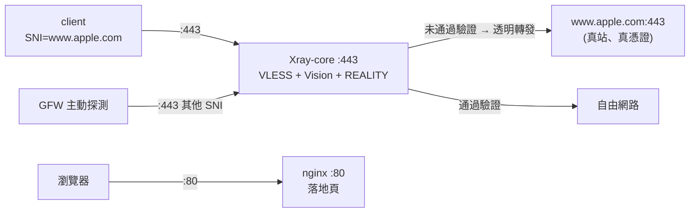

# REALITY 遷移與操作手冊

本專案的 default 協議是 **VLESS + XTLS-Vision + REALITY**（Xray-core）。
這份講**怎麼操作**；**為什麼**要換見 [ProtocolEvaluation.md](ProtocolEvaluation.md)
的實機稽核與決策記錄。

## 三種模式

一個變數決定拓樸：`vpn_protocol`（`ansible/group_vars/all.yml`，可用 host_vars 逐台覆寫）。

之所以是「三選一」而不是「同時全開」，是因為 **REALITY 必須獨佔 443**。它的唯一賣點就是
未通過驗證的探測者會被**透明轉發到真站**——如果 443 前面還坐著一個 nginx，這件事就不成立。
所以 nginx 與 REALITY 不能共用 443，`both` 模式只好把 legacy WS 挪到另一個 port。

### `reality`（default）



- 沒有 Let's Encrypt、沒有 certbot。我們不出示任何自己的憑證。
- nginx 只留 port 80 的落地頁，**沒有** `return 301 https://`——往 443 導只會讓瀏覽器
  拿到 Apple 的憑證卻對不上主機名，變成 TLS 錯誤。

### `vmess_ws`（legacy，= 2026-07 之前的行為）

nginx 用 LE 憑證終結 443 的 TLS，把 `/v2ray` 這條 WebSocket 反代到 Xray 的 VMess inbound。
需要 CDN 前置、或某個裝置的 app 太舊不支援 REALITY 時用這個。

### `both`（過渡期）

REALITY 佔 443，legacy WS 搬到 `vmess_ws_port`（default `2053`，一個常見的替代 HTTPS port）。
兩組 client 設定同時有效，換完再切回 `reality`。

> **記得開防火牆**：ufw 由 `firewall_allowed_tcp` 自動處理，但**雲端那層要自己開**——
> `scripts/az_up.sh` 預設只開 22/80/443。建 VM 時一併帶上：
>
> ```bash
> AZ_EXTRA_PORTS="2053" just az-up
> ```
>
> VM 已經建好的話補一條：
> `az vm open-port -g <rg> -n <vm> --port 2053 --priority 330`

## 金鑰材料

REALITY 需要一組 x25519 金鑰對加一個 short ID。UUID 沿用既有的 `vault_v2ray_uuid`
（VLESS 用同一顆，不另外生）。

```bash
just reality-keys                       # 人類可讀
just reality-keys --format vault-yaml   # 直接貼進 vault 的三行
just reality-keys --verify-with-docker  # 拿真的 xray binary 對答案
```

三個值進 vault（`vault_reality_private_key` / `_public_key` / `_short_id`），
`vars.yml` 已經有對應的 plain-name 別名。**`just az-configure` 會自動生成並寫入**每台
throwaway VM 的 per-host vault，所以 Azure 流程不用手動做這步。

### 為什麼自己實作而不是呼叫 `xray x25519`

`scripts/reality_keys.py` 用 Python 重寫了 `xray x25519`，這樣 laptop 上不需要 xray binary
也不用 pull image。實作嚴格對齊 Xray-core `main/commands/all/curve25519.go`：

```
privateKey[0]  &= 248
privateKey[31] &= 127
privateKey[31] |= 64
編碼一律 base64.RawURLEncoding（URL 字母表、無 padding）
```

**clamping 這步不能省。** Xray 印出來的是**夾過的**私鑰，而 REALITY 是從 config 裡那把私鑰
去推公鑰的。如果寫進 config 的是未夾的值，server 推出來的公鑰就跟你發給 client 的那把對不上：
Xray 正常啟動、TCP 連得上、每一次握手靜靜失敗——症狀與「被牆了」完全無法區分。

正確性由兩件事保證：RFC 7748 §6.1 的 X25519 測試向量，以及 `--verify-with-docker`
（真的跑一次 `xray x25519 -i <私鑰>` 然後 diff）。

## `dest` / `serverNames` 怎麼選

`reality_dest` 是 REALITY 借用握手的真實站點，`reality_server_names` 必須是該站真的會服務的名字。
Default 是 `www.apple.com:443`。

選擇準則：

| 準則 | 原因 |
|---|---|
| 支援 TLS 1.3 + HTTP/2 | REALITY 的偽裝建立在 TLS 1.3 握手結構上 |
| 不會 301 到別的網域 | apex 常導到 `www.`；那就直接寫 `www.` 那個 |
| 地理位置離 VPS 近 | 它的 RTT 會**疊加**到每一次握手 |
| 不是自己國家的站 | 跨境流量打回境內大站看起來很怪 |
| 流量夠大、夠常見 | 罕見站點本身就是特徵 |

備選（都符合上述條件）：`www.microsoft.com:443`、`www.lovelive-anime.jp:443`、
`swdist.apple.com:443`。換的時候 `reality_dest` 與 `reality_server_names` **要一起改**，
然後重跑 `just deploy-fast` 並重發 client 設定（SNI 變了）。

## 坑

### Xray 不支援 `alterId > 0`

Xray-core **完全移除**了舊式非 AEAD 的 VMess。`both` / `vmess_ws` 模式下，任何還停在
`alterId: 64` 的舊 client **完全連不上**（不是變慢，是連不上）。這是換 core 的強制副作用——
也順帶修好了 [ProtocolEvaluation.md](ProtocolEvaluation.md) 稽核第 2 點。
`just az-client` 產出的 VMess 設定一律 `aid: 0`。

### 容器內沒有 shell

`ghcr.io/xtls/xray-core` 是 distroless，官方文件原話「No root privileges, no shell
environment」，且以 **uid 65532** 執行。因此：

- `docker compose exec xray sh` **不存在**。看啟動錯誤用 `just logs-xray-container`
  （= `docker logs xray`），access log 用 `just logs-xray`。
- `runtime/logs/xray` 與 `runtime/xray/config.json` 都由 ansible chown 成 65532，
  不然 Xray 開不了 log、讀不到 config。
- 443 是以 `443:8443` 發佈的（容器內聽 8443）。non-root 綁低 port 會依賴 Docker 的
  `net.ipv4.ip_unprivileged_port_start` default，映射掉就沒這個隱性依賴。

### 用瀏覽器開 `https://<你的域名>/` 會是 TLS 錯誤

預期行為。SNI 不在 `serverNames` 裡的連線會被轉發到 `dest`，於是瀏覽器拿到 Apple 的憑證
卻期待你的域名 → 名稱不符。**這不是壞掉**，`scripts/verify.sh` 甚至把「沒有出現我們自己的
憑證」當成一項必須通過的檢查。

### client 的 `server:` 填 FQDN，不要填裸 IP

REALITY 送出去的是借來的 SNI，跟你連到哪個位址無關。所以 `server:` 保持 FQDN 就好——
這樣 `just az-rotate-ip` 換掉公網 IP 時，**所有 client 設定都不用動**
（見 [IP-ROTATION.md](IP-ROTATION.md)）。填裸 IP 會白白丟掉這個性質。

### short ID 的格式

hex 字元、長度必須是偶數、最多 16 個字元。`reality_keys.py` 預設給 8 個 hex 字元。

## 驗證

兩層，缺一不可：

```bash
just verify        # 前門長得對不對
just verify-proxy  # 流量真的過得去嗎
```

`just verify` 在 `reality` 模式下檢查三件事：

| 檢查 | 意義 |
|---|---|
| `http://$DOMAIN/` → 200 | nginx 還活著 |
| 用**借來的 SNI** 握手 → 憑證鏈有效、subject 命中 dest 站 | 「偷憑證 + 透明轉發」真的在運作 |
| 用**我們自己的域名**握手 → 拿到的**不是**我們的憑證 | 443 上沒有殘留的舊 nginx TLS listener |

但這些全都只證明「前門看起來對」——把 Xray 關掉、讓 nginx 裸轉發到 Apple 也能通過。
真正的證明是 `just verify-proxy`：它用 `out/client/xray-client.json` 起一顆 throwaway
Xray client 容器，經由它抓 `https://www.gstatic.com/generate_204`（期望 204），
再比對出口 IP 是不是這台 VPS。

## 回退

```bash
# ansible/group_vars/all.yml（或該台的 host_vars）
vpn_protocol: vmess_ws
```

然後 `just deploy`。certbot 與 Let's Encrypt bootstrap 會自動回來（憑證不存在時走
ACME-only 流程），nginx 拿回 443，`verify.sh` 自動切回舊的三項檢查。
再跑 `just az-client` 重發 VMess 設定（記得 `alterId` 必須是 0）。

模式切換是安全的：`roles/vpn/tasks/nginx_conf.yml` 會**刪掉**不屬於當前模式的 nginx conf。
沒有這一步的話，上一輪留下的 `ws.conf` 會讓 nginx 繼續嘗試綁 443（現在是 Xray 的）
並去讀一張沒人續期的憑證，然後整個 nginx 起不來、連落地頁一起消失。

## 從既有主機遷移

### Azure throwaway VM

```bash
AZ_YES=1 just az-up
just az-configure          # 自動含 REALITY 金鑰
just deploy
just verify && just az-client && just verify-proxy
```

### 已經存在、vault 早於本次遷移的主機

那些 vault 只有 domain / email / uuid，沒有 REALITY 金鑰。`just az-configure` 會警告，
`vpn` role 也會在 deploy 前 assert 擋下來（而不是讓你部署出一個 privateKey 是空字串、
表面正常卻永遠握手失敗的 server）。補上：

```bash
just reality-keys --format vault-yaml   # 貼進去
just vault-edit <rg>
```

或直接 `scripts/az_configure.py --force --rg <rg>`（連 UUID 一起換）。

### 正式機

`TODO.md` 記載線上那台仍在 pre-IaC 的 legacy 佈局（`~/DockerCompose-V2Ray` 的 git clone），
`just deploy-fast` 打不到它。**本次改動沒有碰它**——所有驗證都在 throwaway VM 上做。
正式機切換等於「先做 TODO.md 那件 IaC 遷移，再跑上面的流程」。
