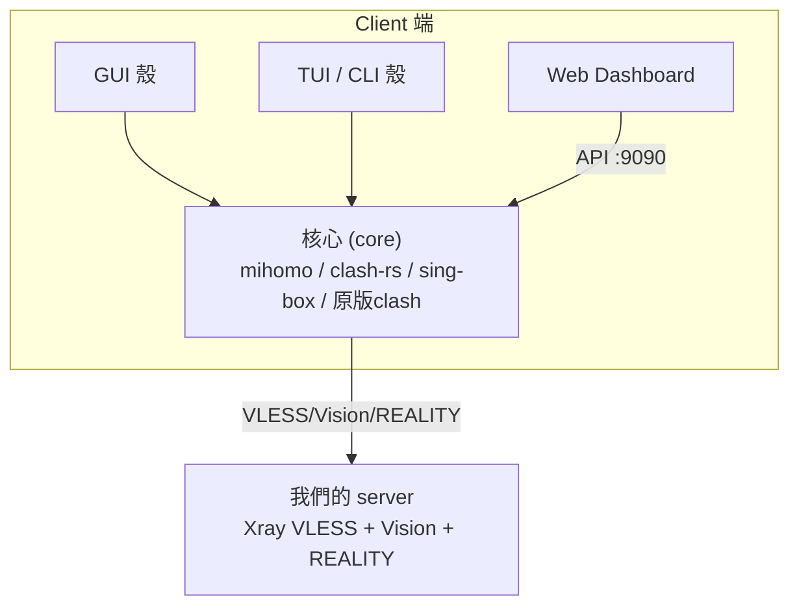

# Clash 生態：server vs client 釐清

回答「似乎有很多不同的 server/client?」，對應
[clashverge.dev](https://www.clashverge.dev/index.html)、
[issue #6 Clients](https://github.com/daviddwlee84/DockerCompose-V2Ray/issues/6)、
[issue #8 Clash TUI/CLI client](https://github.com/daviddwlee84/DockerCompose-V2Ray/issues/8)。

## 心智模型：一個 server、多個 client、可換的核心

關鍵：**「殼」（GUI/TUI/dashboard）與「核心」是分離的。** 多數現代 GUI 內建或自動下載
mihomo 核心；dashboard 則純前端，透過 [API.md](API.md) 的 9090 控制核心。
我們的 server 不變，client 怎麼換都行。

## 1. 核心 (core)

| 核心 | 狀態 | 說明 |
|---|---|---|
| [`MetaCubeX/mihomo`](https://github.com/MetaCubeX/mihomo) | **主流** | Clash.Meta，2026 事實標準（見 [Core.md](Core.md)） |
| [`Watfaq/clash-rs`](https://github.com/Watfaq/clash-rs) | 活躍 | Rust 重寫的 Clash 相容核心 |
| `sing-box` | 活躍 | 通用代理核心，ShellCrash 也支援 |
| 原版 `Dreamacro/clash` | **已封存** | 2023-11 唯讀 |
| `Kuingsmile/clash-core` | 維護鏡像 | 原版同系，凍結於 v1.18。`clients/docker/` 仍用它，但**不支援 VLESS/REALITY**，連不上現在的 server |

## 2. GUI 客戶端

| GUI | 平台 | 狀態 | 備註 |
|---|---|---|---|
| [**Clash Verge Rev**](https://github.com/clash-verge-rev/clash-verge-rev) | Win x64/x86、Linux x64/arm64、macOS 11+ | **推薦** | GPL-3.0、Tauri、內建 mihomo，可從 UI 切換核心；支援 TUN、Merge/Script、WebDav 備份。維護活躍（v2.5.2, 2026-07）。官網 [clashverge.dev](https://www.clashverge.dev/) |
| [`Lythrilla/NeedyClash`](https://github.com/Lythrilla/NeedyClash) | 桌面 | 活躍 | 主打美觀的 clash GUI（issue #6） |
| [FlClash](https://github.com/chen08209/FlClash) | 跨平台（含行動） | 活躍 | Flutter，多平台 |
| Stash | iOS/macOS | 商業 | Apple 平台 |
| ClashX / ClashX Pro | macOS | 已停更 | 不建議新用；**不支援 REALITY** |
| Clash for Windows (CFW) | Windows | 已封存 | 不建議新用；**不支援 REALITY** |

> issue #6 還列了 mihomo 官方文檔與 Clash Verge Rev 的「快速入門」，本質都是指向
> **Verge Rev + mihomo** 這條主線。

## 3. TUI / CLI 客戶端

| 工具 | 角色 | 備註 |
|---|---|---|
| [`JohanChane/clashtui`](https://github.com/JohanChane/clashtui) | TUI（管理核心 + profile） | mihomo (Clash.Meta) 的終端介面（issue #8） |
| [`wzk0/clash_tui`](https://github.com/wzk0/clash_tui) | TUI | 簡易終端介面，適用 Termux 與各 Linux 終端（issue #8） |
| [`juewuy/ShellCrash`](https://github.com/juewuy/ShellCrash) | 安裝/管理 TUI | **不是核心**，幫你裝並託管 mihomo/sing-box（透明代理/旁路由，見 [Core.md](Core.md)） |
| `Kuingsmile/clash-core` CLI | 純核心 | 我們 [`clients/cli/`](../../clients/cli/) 現用，直接 `clash -f config.yaml` |

## 4. Web Dashboard（純前端，走 9090 API）

| Dashboard | 備註 |
|---|---|
| [`metacubexd`](https://github.com/MetaCubeX/metacubexd) | mihomo 官方推薦 |
| [`yacd`](https://github.com/haishanh/yacd) | 我們 vendored 的（[`hinak0/yacd`](https://github.com/hinak0/yacd) 分支，見 [`clients/docker/ui_pages/`](../../clients/docker/ui_pages/)） |
| [`zashboard`](https://github.com/Zephyruso/zashboard) | 社群替代 |

## 5. 行動端 client（iOS / Android）

行動端同樣是「殼 + 核心」。**iOS 的開源選擇近年明顯變多**，不必只靠閉源付費的
Shadowrocket。

### iOS

| App | 核心 | 開源 | 費用 | 備註 |
|---|---|---|---|---|
| [**Clash Mi (clashmi)**](https://github.com/KaringX/clashmi) | mihomo | **是（GPL-3.0）** | 免費 | 內建 mihomo + zashboard 面板，App Store 上架，宣稱不收集資料；官網 [clashmi.app](https://clashmi.app)（**只認官網，慎防二次打包**） |
| [Karing](https://github.com/KaringX/Karing) | sing-box | **是** | 免費 | 同 KaringX 團隊，sing-box 核心，多協議 |
| [sing-box (SFI)](https://github.com/SagerNet/sing-box) | sing-box | **是** | 免費 | 官方 iOS app，支援 VLESS/Reality/Hysteria2/TUIC |
| Shadowrocket | 自家 | 否 | 付費 | 老牌、相容廣（vmess/vless/reality/hy2/tuic），但閉源 |
| Stash | clash 系 | 否 | 付費 | clash 相容、體驗佳，閉源 |
| Loon / Quantumult X | 自家 | 否 | 付費 | 閉源 |

> iOS 注意：多數需**非中國區 Apple ID** 才搜得到/裝得了；優先選**開源 + 官方來源**
> （見本頁「非開源 client 的信任問題」）。

### Android

| App | 核心 | 開源 | 備註 |
|---|---|---|---|
| [**FlClash**](https://github.com/chen08209/FlClash) | mihomo | **是（GPL-3.0）** | 跨平台、無廣告、WebDAV 同步，社群活躍（4w+ star） |
| [ClashMetaForAndroid (CMFA)](https://github.com/MetaCubeX/ClashMetaForAndroid) | mihomo | **是** | MetaCubeX 官方 Android GUI |
| [Clash Mi (clashmi)](https://github.com/KaringX/clashmi) | mihomo | **是** | 同 iOS 版，跨平台一致 |
| [NekoBox / sing-box for Android](https://github.com/MatsuriDayo/NekoBoxForAndroid) | sing-box | **是** | sing-box 系，多協議 |

## 按平台選型建議

| 情境 | 建議 |
|---|---|
| 桌面日常使用（Win/macOS/Linux） | **Clash Verge Rev**（內建 mihomo，最省心）；操作見 [`clients/clash-verge/`](../../clients/clash-verge/README.md) |
| 無頭 Linux / 伺服器 / 旁路由 | **mihomo 核心 + `clashtui`**，或 **ShellCrash** 一鍵透明代理 |
| 行動裝置 | **FlClash / Clash Mi**（Android）、**Clash Mi / sing-box**（iOS，開源）；不介意閉源付費才選 Shadowrocket |
| 本地 Docker 快速測試（本 repo） | 現有 [`clients/docker/`](../../clients/docker/)，建議把核心從 `clash-core` 升級為 **mihomo**（見 [Core.md](Core.md)） |
| 只想看狀態/切節點 | 任何核心 + metacubexd / yacd dashboard（見 [API.md](API.md)） |

## 非開源 client 的信任問題與替代選項

代理 client 看得到你**所有明文流量**、持有節點憑證、還能改路由 —— 信任成本極高。
歷史上閉源/來路不明的 client 出過事：**Clash for Windows** 後期閉源且作者收到法律壓力後
停更下架；部分第三方「魔改」安裝包被驗出夾帶後門/竊密。對這類工具要有警覺。

### 風險點

- **閉源**：無法稽核它把流量/憑證送去哪。
- **非官方安裝包**：第三方站、網盤、「綠色版」常被植入惡意程式。
- **自動更新不透明**：更新通道若被劫持，等於遠端裝後門。
- **挾帶推廣/機場綁定**：部分免費 client 內建上報或強制特定訂閱。

### 降低信任成本的原則

1. **優先選開源**，且能對照 release 與原始碼（GitHub Releases）。
2. **只從官方來源下載**（官方 GitHub Releases / 官網），核對
   checksum 或 release 簽章；避免網盤與第三方鏡像。
3. **核心與殼分離**：核心固定用開源 **mihomo**；殼盡量也用開源、活躍維護的專案。
4. **最小權限**：API 設 `secret` 或綁 loopback（見 [API.md](API.md)）；TUN/系統代理用完即關。
5. **可重現/可自建**：能自己 `docker build` 或從源碼編譯的方案，信任成本最低。

### 開源、可信的替代選項

| 取代 | 建議替代（開源） | 備註 |
|---|---|---|
| Clash for Windows（閉源、已停更） | [**Clash Verge Rev**](https://github.com/clash-verge-rev/clash-verge-rev) | GPL-3.0、Tauri、內建 mihomo、活躍維護，Win/macOS/Linux |
| ClashX / ClashX Pro（macOS，停更） | Clash Verge Rev（macOS） / [FlClash](https://github.com/chen08209/FlClash) | 皆開源 |
| 各種閉源行動端 | [FlClash](https://github.com/chen08209/FlClash)（Android）、開源 sing-box GUI | iOS 開源選擇少，謹慎評估 |
| 任何閉源核心 | [**mihomo**](https://github.com/MetaCubeX/mihomo)（MIT 系）、[clash-rs](https://github.com/Watfaq/clash-rs) | 核心一律用開源 |
| 想完全自控 | 本 repo 的 [`clients/docker/`](../../clients/docker/)（自建 image）+ 開源 dashboard | 自己 build，不依賴預編譯二進位 |

> 一句話：**核心鎖定 mihomo（開源）、殼用 Clash Verge Rev（開源、官方 Releases）、
> 能自建就自建**，是兼顧可用性與可稽核性的務實組合。

## 與本專案的關係

- 我們**只提供 server**；client 是使用者自選。repo 內附的
  [`clients/docker/`](../../clients/docker/)（Docker 化 clash + yacd）與
  [`clients/cli/`](../../clients/cli/)（Linux CLI）只是**範例/本地測試**用途。
- 兩者目前都綁在已凍結的 `Kuingsmile/clash-core`；長期建議統一遷往 **mihomo**。
- 本次為研究記錄，不改動 client 代碼。

## 參考

- [Clash Verge Rev Docs](https://www.clashverge.dev/index.html)
- [Clash 生態 2026：活躍專案](https://clashblog.com/en/blog/articles/clash-ecosystem-2026.html)
- repo issues：[#6 Clients](https://github.com/daviddwlee84/DockerCompose-V2Ray/issues/6)、
  [#8 Clash TUI/CLI](https://github.com/daviddwlee84/DockerCompose-V2Ray/issues/8)
