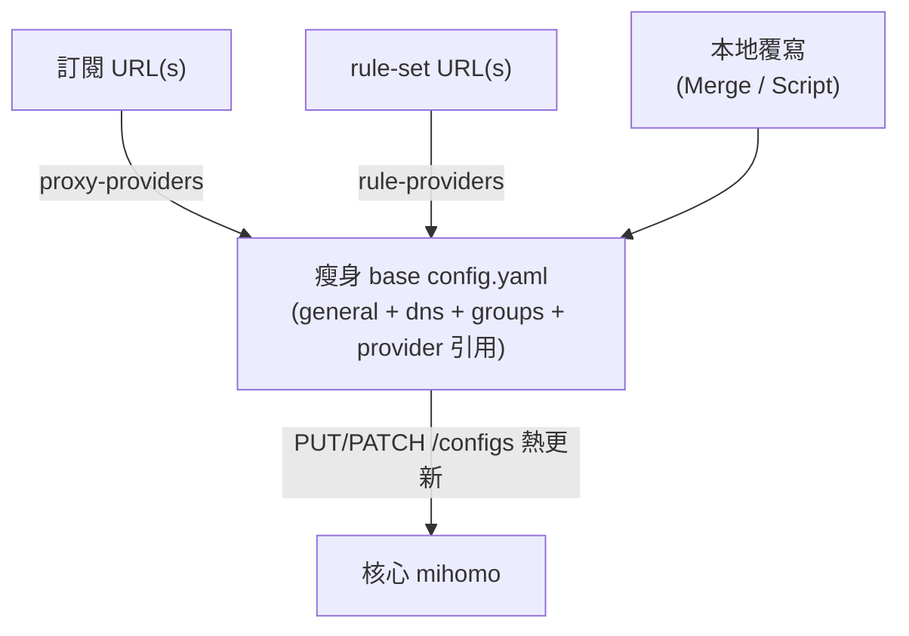

# 系統性配置管理：config.yaml schema + URL 化 + 熱更新

回答「系統性的配置管理方案 (a. config.yaml schema, b. rules/profiles by URL / hot update)」。

現況痛點：我們的 [`clients/docker/config.yaml`](../../clients/docker/config.yaml)
把**節點、proxy-groups、整份 rules 全部寫死 inline**（GEOIP/DOMAIN-SUFFIX 一長串）。
每次改規則或換節點都要手改檔案，無法版本化、無法多端共享、無法自動更新。
系統化的做法是：**瘦身成 base config + 把節點與規則 URL 化（providers）+ 用 API 熱更新**。

## a. config.yaml schema

### 頂層區塊一覽

| 區塊 | 作用 |
|---|---|
| general / inbound | `port` / `socks-port` / `mixed-port` / `allow-lan` / `mode` / `log-level` / `external-controller` … |
| `dns` | DNS 設定（mihomo：DoH/DoT/DoQ、`fake-ip`、`fake-ip-filter`、policy DNS） |
| `proxies` | inline 節點清單 |
| `proxy-groups` | 策略組（`select` / `url-test` / `fallback` / `load-balance`） |
| `proxy-providers` | **從 URL 拉節點**（見下） |
| `rules` | 規則清單 |
| `rule-providers` | **從 URL 拉 rule-set**（見下） |
| `tun` | TUN 透明代理（mihomo 完整支援） |
| `sniffer` | 流量嗅探（按域名分流） |

### 編輯器 schema（補全 + 校驗）

在 YAML 第一行掛 schema，讓 VS Code（`yaml-language-server` 擴充）提供自動補全與錯誤提示：

```yaml
# yaml-language-server: $schema=https://raw.githubusercontent.com/MetaCubeX/mihomo/Meta/docs/schema.json
port: 7890
mode: rule
# ...
```

> 不同來源的 schema 連結可能變動；以 mihomo wiki 的
> [config 參考](https://wiki.metacubex.one/en/config/) 為準。

## b. 用 URL 管理 rules / profiles + 熱更新

### proxy-providers：節點來自訂閱 URL

把 inline `proxies` 換成從訂閱 URL 拉取，並自動刷新 + 健康檢查：

```yaml
proxy-providers:
  my-sub:
    type: http
    url: "https://your-subscription-url"
    interval: 3600          # 秒，自動刷新
    path: ./providers/my-sub.yaml
    health-check:
      enable: true
      url: http://www.gstatic.com/generate_204
      interval: 300

proxy-groups:
  - name: PROXY
    type: select
    use:                     # 引用 provider，而非寫死 proxies
      - my-sub
```

### rule-providers：規則來自 URL（rule-set）

把那一長串 inline `rules` 換成外部 rule-set，集中維護、自動更新：

```yaml
rule-providers:
  reject:
    type: http
    behavior: domain        # domain / ipcidr / classical
    format: yaml            # yaml / text / mrs
    url: "https://example.com/reject.yaml"
    path: ./rules/reject.yaml
    interval: 86400

rules:
  - RULE-SET,reject,REJECT
  - GEOIP,CN,DIRECT
  - MATCH,PROXY
```

| 欄位 | 說明 |
|---|---|
| `behavior` | `domain`（域名）/ `ipcidr`（IP 段）/ `classical`（完整規則語法） |
| `format` | `yaml` / `text` / `mrs`（mihomo 二進位，體積小、載入快） |
| `url` / `path` / `interval` | 來源 URL / 本地快取路徑 / 刷新秒數 |

> 這裡的 `url` 從哪來、怎麼**自己 host**（含 Shadowrocket 格式與 best practice），
> 見專章 [SelfHostProviders.md](SelfHostProviders.md)。

### 熱更新（不重啟核心）

透過 [API.md](API.md) 的 9090 端點即可熱套用：

| 動作 | 呼叫 |
|---|---|
| 重載整份設定檔 | `PUT /configs?force=true` |
| 局部更新欄位 | `PATCH /configs`，例如 `{"mode": "global"}` |
| 更新某 proxy-provider | `PUT /providers/proxies/:name` |
| 觸發健康檢查 | `GET /providers/proxies/:name/healthcheck` |

GUI（如 Clash Verge Rev）背後就是用這些 API；它另外提供：

- **profile 排程更新**（按 interval 自動拉訂閱）；
- **Merge / Script enhancement**：用一份覆寫檔（Merge）或 JS 腳本（Script）在套用前
  注入/改寫節點與規則 —— 等於「base profile + 本地覆寫」分層管理；
- **多訂閱合併** 與 WebDav 備份同步。

### 多訂閱合併 / 轉換

- [subconverter](https://github.com/tindy2013/subconverter)：把多個訂閱轉換/合併成一份
  Clash 設定，並可注入統一的 rule-providers / proxy-groups 範本。
- Clash Verge Rev 的「多訂閱合併」可在 client 端直接合併。

## 在 terminal 改配置：TUI / 編輯檔案 / API 三選一

常見問題：「在終端機要用 TUI 快速改、直接編輯設定檔、還是走 API？」三者**用途不同、可並用**：

| 方式 | 改的是什麼 | 是否持久 | 適合 |
|---|---|---|---|
| **編輯設定檔** + reload | `config.yaml` 本體 | **持久**（檔案即真相，可進 git） | 結構性變更：加節點/規則、改 dns/groups |
| **TUI**（如 [`clashtui`](https://github.com/JohanChane/clashtui)） | profile 檔 + 觸發 reload | 持久（它寫檔） | 無頭 Linux 上**管理多 profile、切換、更新訂閱、測延遲** |
| **API / dashboard** | 核心**執行中**狀態 | **多為暫時**（reload 後失效，除非寫回檔） | 臨時操作：切節點、改 mode、healthcheck、看流量/日誌 |

關鍵心智：

- **設定檔 = 真相來源（source of truth）**，建議版本控管；改完用
  `PUT /configs?force=true` 熱重載（見 [API.md](API.md)），不必重啟核心。
- **API/dashboard 的執行期切換是暫時的** —— 例如用 `PUT /proxies/:name` 切了節點，
  一旦 reload 設定檔就回到檔案裡寫的預設。要持久化得寫回設定檔。
- **TUI 介於兩者之間**：它直接編輯 profile 檔（持久）並透過 API 觸發套用，
  所以在伺服器/旁路由這種沒有 GUI 的場景最順手。

```bash
# 編輯檔案 → 熱重載（持久）
$EDITOR config.yaml
export CLASH_SECRET='your-secret-here'
curl -H "Authorization: Bearer ${CLASH_SECRET}" \
  -X PUT 'http://127.0.0.1:9090/configs?force=true' -d '{"path":"","payload":""}'

# 執行期切節點（暫時，reload 後失效）
curl -H "Authorization: Bearer ${CLASH_SECRET}" \
  -X PUT 'http://127.0.0.1:9090/proxies/PROXY' -d '{"name":"Proxy 1"}'
```

> 建議流程：**檔案管結構（git）＋ TUI/dashboard 管日常切換**。
> 大改動走 providers + 熱重載，臨時測試走 API。

## 系統化分層架構（建議）



核心理念：**base 設定只描述結構（groups、dns、provider 引用），實際節點與規則都來自
可自動刷新的 URL**；改動透過熱更新生效，不必重啟。

## 對接本專案現況

- 今天 [`clients/docker/config.yaml`](../../clients/docker/config.yaml) 是全 inline 的反例。
  系統化重構方向：保留 general/dns/groups 骨架 → 節點移到 `proxy-providers` →
  規則移到 `rule-providers`。
- repo 目前用 `just az-client` 產出**靜態** `clash.yaml`（見根
  [`README.md`](../../README.md) 的 Azure 章節）。未來可改成輸出 **provider 版**
  （base + 指向自家訂閱/規則 URL），讓多端共享同一份可熱更新設定。
- 本次為研究記錄，**不改動 client 設定或產生器**；以上為後續方向。

## 參考

- [mihomo config 總覽](https://wiki.metacubex.one/en/config/)
- [proxy-providers](https://wiki.metacubex.one/en/config/proxy-providers/) ／
  [rule-providers](https://wiki.metacubex.one/en/config/rule-providers/)
- [配置文件 | Clash for Windows 說明](https://docs.gtk.pw/contents/configfile.html)（CFW 已封存，但 classic 設定檔格式說明仍可參考——mihomo 對它向後相容）
- [Clash Verge Rev：多訂閱合併 / 配置案例](https://www.clashverge.dev/index.html)
