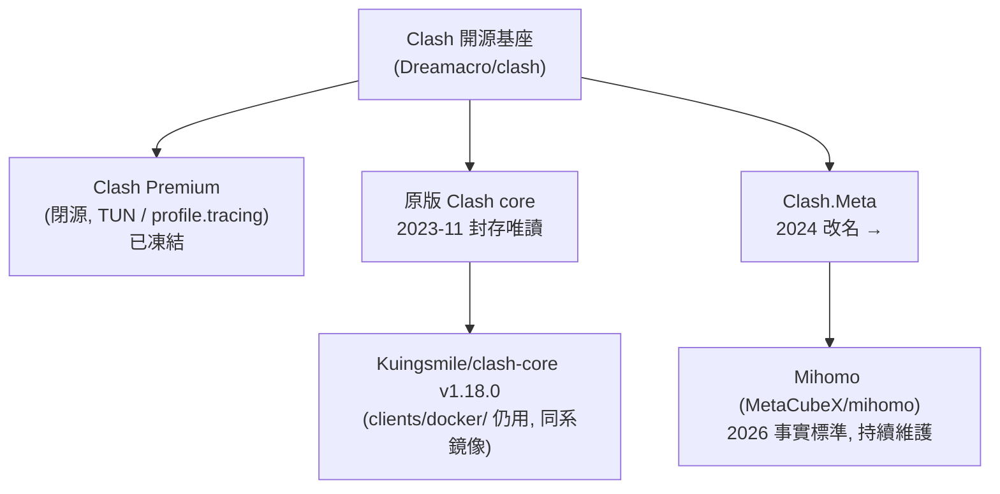

# Clash 核心：Mihomo vs 現用版本（含 ShellCrash 釐清）

回答「Mihomo (Clash.Meta) 跟我們現在的版本有什麼區別？(Shell Crash/Clash?)」。

本專案的 client 端（[`clients/docker/`](../../clients/docker/)、[`clients/cli/`](../../clients/cli/)）
目前跑的是一個**已凍結**的 Clash 核心。這篇釐清「核心 (core)」這條血脈的演化，
以及「ShellCrash」其實不是核心，而是一個安裝/管理工具。

## TL;DR

- [`clients/docker/`](../../clients/docker/) 仍綁 `Kuingsmile/clash-core` **v1.18.0**
  —— 原版 Dreamacro Clash 的維護鏡像，與原版同一系，**已停在 2023 年的能力上、
  不再有新協議與安全更新**。自 2026-07 server 端改用 REALITY 之後，它**連不上**了。
- **Mihomo（MetaCubeX，前稱 Clash.Meta）** 是 2026 年事實上的標準核心，持續維護，
  新增 Hysteria2 / TUIC v5 / VLESS+REALITY / SS2022 等現代協議，且 **YAML 向後相容**
  —— 對我們而言基本上「換 binary 即可」。
- 「**Shell Crash/Clash**」指的是 [`juewuy/ShellCrash`](https://github.com/juewuy/ShellCrash)
  （及同類 `ShellClash`）——它**不是核心**，是 Linux/OpenWrt 上的安裝與管理 TUI 腳本，
  底層幫你跑 mihomo 或 sing-box。詳見 [Clients.md](Clients.md)。

## 三條血脈對照



| 維度 | 原版 Clash / `Kuingsmile/clash-core` | Clash Premium | Mihomo (Clash.Meta) |
|---|---|---|---|
| 維護狀態 | 原版 2023-11 封存；鏡像僅補丁，無新協議 | 凍結（閉源） | **持續維護**，頻繁發版 |
| Hysteria2 | 不支援 | 不支援 | **支援** |
| TUIC v5 | 不支援 | 不支援 | **支援** |
| VLESS + REALITY | 不支援 | 不支援 | **支援**（`reality-opts:`） |
| Shadowsocks 2022 | 不支援 | 不支援 | **支援**（`cipher: 2022-blake3-*`） |
| ShadowTLS | 不支援 | 不支援 | **支援** |
| TUN 模式 | 無/受限 | 內建（Premium 賣點） | **完整**（`tun:` 區塊） |
| DNS | 基本 | 基本 | **DoH/DoT/DoQ、fake-ip-filter、policy DNS** |
| rule / rule-providers | 基本 | 基本 + tracing | **更豐富**（inline `rule-set`、`mrs` 等） |
| `external-controller` API | `0.0.0.0:9090`（相容） | 同 | 同語法相容（見 [API.md](API.md)） |
| YAML 設定相容 | — | — | **向後相容典型 Clash YAML** |

> 命名小抄：**Clash.Meta = Meta = mihomo** 是同一專案，2024 改名為 mihomo。
> 文件/UI 裡看到這三個名字都是它。

## 對本專案的遷移含義

**2026-07 更新**：server 端已遷到 **VLESS + XTLS-Vision + REALITY**
（見根 [`README.md`](../../README.md) 與 [REALITY-MIGRATION.md](../REALITY-MIGRATION.md)）。
這把「換成 mihomo」從建議變成**必要**——凍結的 `clash-core` 不支援 REALITY。

```yaml
proxies:
  - name: "Proxy 1"
    type: vless
    server: your-dns-name.japaneast.cloudapp.azure.com
    port: 443
    uuid: your-uuid
    network: tcp
    udp: true
    tls: true
    flow: xtls-rprx-vision
    servername: www.apple.com        # 借來的 SNI，與 server: 無關
    reality-opts:
      public-key: <REALITY_PUBLIC_KEY>
      short-id: <REALITY_SHORT_ID>
    client-fingerprint: chrome
```

不用手抄——`just az-client` 會直接產出這段（含正確的 key/short-id）。
完整的 client 範例見 [`clients/mihomo-docker/config.example.yaml`](../../clients/mihomo-docker/config.example.yaml)。

> 這裡談的是 **client 核心**。至於 **server 端協議**為何要換（實機稽核、GFW 偵測風險），
> 見 [docs/ProtocolEvaluation.md](../ProtocolEvaluation.md)。

### 舊 VMess 設定的 caveat：`alterId`

[`clients/docker/config.yaml`](../../clients/docker/config.yaml) 過去用 `alterId: 64`，
這是舊式 VMess（MD5 認證，已淘汰）。換到 Xray-core 之後這不再只是「建議改」——
**Xray 完全移除了 `alterId > 0`**，還停在 64 的 client 直接連不上。
`vpn_protocol: vmess_ws` / `both` 模式下一律用 `alterId: 0`（AEAD）。

## 「ShellCrash / ShellClash」到底是什麼

問題裡的「Shell Crash/Clash」**容易與核心混淆**，它其實是**安裝/管理層**：

- [`juewuy/ShellCrash`](https://github.com/juewuy/ShellCrash)：Linux/OpenWrt/路由器上的
  一鍵安裝 + 互動式 TUI，幫你下載並託管 **mihomo 或 sing-box** 當 client，
  常用於透明代理／旁路由。設定檔位置如 `/usr/share/ShellCrash/yamls/proxies.yaml`。
  （[README_CN](https://github.com/juewuy/ShellCrash/blob/dev/README_CN.md)）
- [`liyaoxuan/ShellClash`](https://github.com/liyaoxuan/ShellClash)：同類 shell 管理腳本。
- [`echvoyager/shellclash_docker`](https://github.com/echvoyager/shellclash_docker)：用 Docker
  跑虛擬 OpenWrt 容器來承載 ShellClash 的透明代理方案。

所以正確的心智模型是：**核心（mihomo） ≠ 管理工具（ShellCrash）**。ShellCrash 是「怎麼裝、怎麼開機自啟、怎麼透明代理」，核心才是真正跑協議的引擎。

## 其他核心（補充）

- [`Watfaq/clash-rs`](https://github.com/Watfaq/clash-rs)：Rust 重寫的 Clash 相容核心
  （[使用手冊](https://watfaq.gitbook.io/clashrs-user-manual)）。
- `sing-box`：另一套通用代理核心，ShellCrash 也支援。

完整 client/核心生態見 [Clients.md](Clients.md)。

## 參考

- [Clash Meta vs Premium Core (2026)](https://clashblog.com/en/blog/articles/clash-meta-vs-premium-2026.html)
- [Clash Meta → mihomo 遷移指南](https://clashsource.com/en/blog/articles/clash-meta-upgrade-guide.html)
- [MetaCubeX/mihomo](https://github.com/MetaCubeX/mihomo) ／ [mihomo wiki](https://wiki.metacubex.one/en/)
