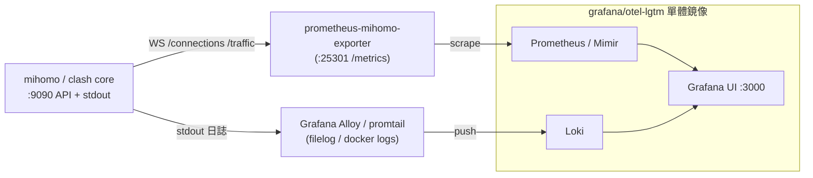

# Clash 可觀測性：log / metrics 送進 Grafana（otel-lgtm）

回答「Clash 的 log 能扔到 Grafana (Otel-LGTM) 嗎？」。

簡短答案：**能，但要橋接。** Clash/mihomo 本身**沒有原生 Prometheus/OTel 輸出**，
需要一個 exporter（metrics）與一個 log shipper（logs）把資料送進 LGTM 堆疊。

## 兩個資料面

Clash 核心對外有兩種可觀測資料：

1. **文字日誌**：寫到 stdout/檔案，等級由 `log-level`（`silent`/`error`/`warning`/`info`/`debug`）控制。
2. **API 串流**（`external-controller` port，見 [API.md](API.md)）：
   - `/logs`（GET/WS）即時日誌
   - `/traffic`（GET/WS）即時上下行（kbps）
   - `/memory`（GET/WS）記憶體（kb）
   - `/connections`（GET/WS）逐連線明細（含 host / proxy / 規則命中）

LGTM = **L**oki（logs）+ **G**rafana + **T**empo（traces）+ **M**imir/Prometheus（metrics）。
本場景沒有 traces，主要用到 Loki + Prometheus + Grafana。

## 拓撲



## 路徑 A：Metrics → Prometheus → Grafana

Clash 沒有 `/metrics`，用社群 exporter 把 API 轉成 Prometheus 格式：

| Exporter | 抓取方式 | 指標重點 | 備註 |
|---|---|---|---|
| [`kookxiang/prometheus-mihomo-exporter`](https://github.com/kookxiang/prometheus-mihomo-exporter) | WS `/connections` | `statistic_by_asn` / `_client` / `_host` / `_proxy` 流量 | 預設 `:25301`，專為 mihomo |
| [`zxh326/clash-exporter`](https://github.com/zxh326/clash-exporter) | API 輪詢 | `clash_download_bytes_total`、`clash_active_connections`、tracing histograms | Grafana dashboard id **18530**；tracing 需 premium `profile.tracing` |
| [`elonzh/clash_exporter`](https://github.com/elonzh/clash_exporter) | API 輪詢 | `clash_proxy_delay`、`clash_up`、上下行 total | 較精簡 |

`kookxiang/prometheus-mihomo-exporter` 範例：

```bash
docker run -d -p 25301:25301 \
  -e MIHOMO_HOST=your-host -e MIHOMO_PORT=9090 \
  -e MIHOMO_TOKEN=your_secret \
  ghcr.io/kookxiang/prometheus-mihomo-exporter
```

```yaml
# prometheus.yml
scrape_configs:
  - job_name: 'mihomo'
    static_configs:
      - targets: ['mihomo-exporter:25301']
```

> 注意：`zxh326/clash-exporter` 預設 `collectDest=true` 會按目的地展開大量 series，
> Prometheus 記憶體會暴增；長期跑建議 `-collectDest=false`。

## 路徑 B：Logs → Loki → Grafana

核心日誌走 stdout（我們的容器 `CMD ["clash", "-f", ...]` 即輸出到 stdout）。
任選一個 shipper：

- **Grafana Alloy**（推薦，新一代）或 **promtail**：用 Docker discovery / filelog 抓容器 stdout 推到 Loki。
- **OpenTelemetry Collector** 的 `filelog` receiver：抓檔案/容器日誌 → `lokiexporter`（或 OTLP → otel-lgtm 內建 collector）。
- 也可消費 `/logs` WS 串流，自行轉成日誌行（較少見，需要一支小程式）。

## 用 grafana/otel-lgtm 做 all-in-one

[`grafana/otel-lgtm`](https://github.com/grafana/docker-otel-lgtm) 是把
OTel Collector + Loki + Tempo + Prometheus + Grafana 打包成**單一容器**的 demo/開發鏡像，
最省事的本地驗證方式：

```yaml
# 概念示意（本次不落地，僅文件範例）
services:
  lgtm:
    image: grafana/otel-lgtm
    ports:
      - "3000:3000"   # Grafana
      - "4317:4317"   # OTLP gRPC
      - "4318:4318"   # OTLP HTTP
  mihomo-exporter:
    image: ghcr.io/kookxiang/prometheus-mihomo-exporter
    environment:
      MIHOMO_HOST: clash
      MIHOMO_PORT: "9090"
      MIHOMO_TOKEN: your_secret
```

之後在內建 Prometheus 加上 scrape job、用 Alloy/OTel filelog 把 clash 容器 stdout 推進 Loki，
即可在 Grafana 同時看 metrics + logs。

> `otel-lgtm` 官方定位是 demo/本地用途，不建議直接當生產堆疊；生產請分開部署 Loki/Mimir/Grafana。

## 與本專案的關係

- 這裡談的是 **client 端**（你電腦/旁路由上的 Clash）可觀測性。
- **server 端**（VPS 上 nginx / v2ray 的 access/error log）是另一回事，已由
  [`docs/LOG-ROTATION.md`](../LOG-ROTATION.md) 處理 logrotate。若未來想把 server 日誌
  也送 LGTM，可在 VPS 上加 Alloy/promtail 抓 `/opt/vpn/runtime/logs/{nginx,v2ray}/`，
  屬另一個獨立議題。
- 本次為研究記錄，**不在 repo 落地 exporter / Grafana compose**。

## 參考

- [mihomo API 文檔](https://wiki.metacubex.one/en/api/)
- [grafana/docker-otel-lgtm](https://github.com/grafana/docker-otel-lgtm)
- [`kookxiang/prometheus-mihomo-exporter`](https://github.com/kookxiang/prometheus-mihomo-exporter)
  ／ [`zxh326/clash-exporter`](https://github.com/zxh326/clash-exporter)
  ／ [`elonzh/clash_exporter`](https://github.com/elonzh/clash_exporter)
