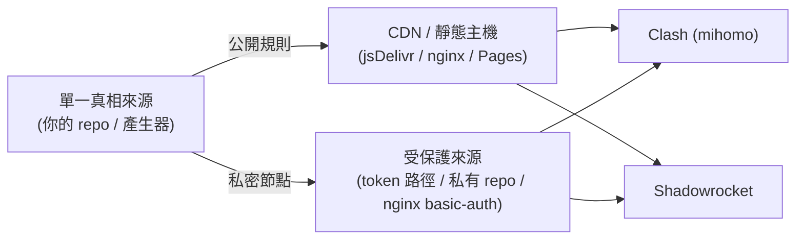

# 自架 Provider：節點與規則 URL 化（Clash + Shadowrocket）

[ConfigManagement.md](ConfigManagement.md) 講了「用 URL 管理節點/規則」的語法，
這章回答**「究竟如何 self-host provider」**——也就是把那些 URL **放在你自己控制的地方**，
讓 Clash（`proxy-providers` / `rule-providers`）與 Shadowrocket（遠端 config / `RULE-SET`）
都能拉取並自動更新。對應 [issue #7 Rules](https://github.com/daviddwlee84/DockerCompose-V2Ray/issues/7)。

## 先分清楚：你要 host 的是兩種東西

| 類型 | 內容 | 機敏性 | Clash | Shadowrocket |
|---|---|---|---|---|
| **節點清單 / 訂閱** | 你的 server、UUID、path… | **高（=帳密）** | `proxy-providers` | `Subscribe` / 遠端 config 的 `[Proxy]` |
| **規則集 (rule-set)** | 域名/IP/分流規則 | 低（多為公開） | `rule-providers` | `RULE-SET` / `DOMAIN-SET` |

**核心原則：規則可公開，節點清單必須保護。** 別把含 UUID 的訂閱丟到公開 repo。



## Host 在哪裡？選項比較

| 方式 | 適合 | 自動更新 | GFW 可達性 | 機敏內容 |
|---|---|---|---|---|
| **自家 nginx 靜態目錄**（本專案已有 nginx） | 規則 + 節點 | 看 client `interval` | 看 VPS IP 是否被封 | 可加 basic-auth / 隱秘路徑 |
| **GitHub repo + raw / [jsDelivr](https://www.jsdelivr.com/) CDN** | 公開規則 | client `interval` | jsDelivr 較穩 | **勿放節點** |
| **GitHub Pages / Gist** | 公開規則 | client `interval` | 中 | 勿放節點 |
| **物件儲存（Cloudflare R2 / S3）+ CDN** | 兩者皆可 | client `interval` | R2/Cloudflare 佳 | 用簽名 URL / token |
| **自架 [subconverter](https://github.com/tindy2013/subconverter)** | 一份訂閱→多格式 | 即時轉換 | 看部署位置 | 後端持有節點，注意保護 |

> 對抗 GFW 的小訣竅：規則用 **jsDelivr / Cloudflare** 這類大 CDN 比直接連 `raw.githubusercontent.com`
> 穩；節點清單則放在你能控管存取的地方（受保護路徑 / 私有來源）。

## A. 通用 Clash（mihomo）

把節點與規則都指向你自架的 URL，base 設定只留骨架：

```yaml
# 自架 provider 版 base config（節選）
proxy-providers:
  my-nodes:
    type: http
    url: "https://vpn.example.com/private/<random-token>/nodes.yaml"  # 受保護路徑
    interval: 3600
    path: ./providers/my-nodes.yaml
    health-check: { enable: true, url: http://www.gstatic.com/generate_204, interval: 300 }

rule-providers:
  reject:
    type: http
    behavior: domain
    format: mrs            # mihomo 二進位，大規則集載入快、體積小
    url: "https://cdn.jsdelivr.net/gh/<you>/<rules-repo>@main/reject.mrs"
    path: ./rules/reject.mrs
    interval: 86400

proxy-groups:
  - name: PROXY
    type: select
    use: [my-nodes]        # 引用 provider，而非寫死 proxies

rules:
  - RULE-SET,reject,REJECT
  - GEOIP,CN,DIRECT
  - MATCH,PROXY
```

`nodes.yaml`（你自架的節點清單檔，內容就是一段 `proxies:`）：

```yaml
proxies:
  - { name: "JP-1", type: vmess, server: your.domain.tld, port: 443, uuid: <uuid>, alterId: 0, cipher: auto, tls: true, network: ws, ws-opts: { path: /v2ray } }
```

> 規則集要轉成 `.mrs` 可用 mihomo：`mihomo convert-ruleset domain yaml reject.yaml reject.mrs`。
> 不想轉就用 `format: yaml` / `text`。

## B. Shadowrocket

Shadowrocket 用的是 **Surge 風格 `.conf`**（不是 Clash YAML），自架方式有兩層：

### B-1. 自架整份遠端 config（含節點 + 規則）

把一份 `.conf` 放到你的 URL，App 內 **Config → 右上角 `+` → 從 URL 加入**，
之後點 `ⓘ` → Update 即可更新（也可設定自動更新）。`.conf` 結構：

```ini
[General]
bypass-system = true
dns-server = https://dns.google/dns-query
skip-proxy = 127.0.0.1, 192.168.0.0/16, 10.0.0.0/8, localhost, *.local

[Proxy]
JP-1 = vmess, your.domain.tld, 443, username=<uuid>, ws=true, ws-path=/v2ray, tls=true, alterId=0

[Proxy Group]
PROXY = select, JP-1
Final = select, PROXY, DIRECT

[Rule]
# 自架 / 第三方遠端規則集（純文字 .list，逐行 top-down 比對）
RULE-SET,https://cdn.jsdelivr.net/gh/<you>/<rules-repo>@main/reject.list,REJECT
RULE-SET,https://raw.githubusercontent.com/Johnshall/Shadowrocket-ADBlock-Rules-Forever/release/sr_top500_banlist.conf,REJECT
GEOIP,CN,DIRECT
FINAL,PROXY
```

### B-2. 只自架規則集（沿用既有 config）

不想搬整份設定，只想加遠端規則：在 `[Rule]` 用

```ini
RULE-SET,<你的-rules.list-url>,POLICY      # 規則集：每行含規則類型
DOMAIN-SET,<你的-domains.list-url>,POLICY  # 域名集：每行只有域名
```

規則由上往下比對，`RULE-SET` 要放在 `FINAL` 之上。現成可用的公開規則源：
[Johnshall/Shadowrocket-ADBlock-Rules-Forever](https://github.com/Johnshall/Shadowrocket-ADBlock-Rules-Forever)
（每日 8 時重建，issue #7）、[blackmatrix7/ios_rule_script](https://github.com/blackmatrix7/ios_rule_script)。

## 一份來源、多種 client

Clash 與 Shadowrocket 規則語法**高度重疊**（`DOMAIN-SUFFIX,...` / `IP-CIDR,...` / `GEOIP,...`），
規則檔常可共用。節點則格式不同（YAML vs `.conf`），靠 **subconverter** 從同一份訂閱產生兩種輸出：

```text
單一訂閱 / 節點來源
        │  subconverter (自架)
        ├── &target=clash   → clash.yaml（給 mihomo）
        └── &target=shadowrocket → shadowrocket.conf（給 SR）
```

subconverter 也能在轉換時統一注入你的 `rule-providers` / `RULE-SET` 範本，做到「規則集中、輸出多端」。

## Best practice（重點整理）

1. **規則公開、節點保護**：規則放公開 repo + CDN；節點清單放受保護路徑（隱秘 token、
   私有 repo + raw token、或 nginx basic-auth），**永遠不要 commit 含 UUID 的訂閱到公開 repo**。
2. **CDN 提升 GFW 可達性**：公開規則走 jsDelivr / Cloudflare，比直連 GitHub raw 穩。
3. **合理的 `interval`**：規則 1 天、節點 1 小時即可；別設太短打爆來源。
4. **大規則集用 `mrs`**（mihomo）：載入快、體積小。
5. **保底 fallback**：base config 內留最小 inline 規則（如 `GEOIP,CN,DIRECT` + `MATCH,PROXY`），
   萬一 provider 拉取失敗，client 仍可運作。
6. **版本化你的「真相來源」**：規則/base 進 git；節點清單由產生器輸出、不入庫。
7. **熱更新而非重啟**：改完用 `PUT /configs?force=true`（見 [API.md](API.md)）。

## 對接本專案

本專案**已經在 VPS 上跑 nginx**（[`server/compose.yml`](../../server/compose.yml) +
[`server/templates/nginx/v2ray.conf.tmpl`](../../server/templates/nginx/v2ray.conf.tmpl)），
天然就是個現成的靜態主機，可順手兼當 provider host：

- 在 nginx 加一個 `location /provider/`（建議 basic-auth 或隱秘路徑）指向一個目錄，
  放 `nodes.yaml` / 規則檔，client 端用該 URL 當 `proxy-providers` / `RULE-SET`。
- 產生器面：`just az-client` 目前輸出**靜態** `out/client/clash.yaml`（見根
  [`README.md`](../../README.md)）；可擴充成同時輸出 `nodes.yaml`（provider 版）與
  `shadowrocket.conf`，並（可選）推送到上述 nginx 路徑。
- 機敏處理沿用既有機制：[`scripts/redact_secrets.py`](../../scripts/redact_secrets.py)、
  pre-commit 的 gitleaks——確保節點/UUID 不外洩。

> 以上為方向與範例，**本次僅文檔，不改動 server / client 代碼**（協議與 nginx 變更
> 仍受 [CLAUDE.md](../../CLAUDE.md) 約束）。

## 參考

- [mihomo proxy-providers](https://wiki.metacubex.one/en/config/proxy-providers/) ／
  [rule-providers](https://wiki.metacubex.one/en/config/rule-providers/)
- [Shadowrocket 設定檔格式 / 規則系統 (DeepWiki)](https://deepwiki.com/LOWERTOP/Shadowrocket/6.1-configuration-file-format)
- [Johnshall/Shadowrocket-ADBlock-Rules-Forever](https://github.com/Johnshall/Shadowrocket-ADBlock-Rules-Forever)
  ／ [blackmatrix7/ios_rule_script](https://github.com/blackmatrix7/ios_rule_script)
- [subconverter](https://github.com/tindy2013/subconverter)
